class: middle, center, title-slide
count: false

# Towards Differentiable Physics Analysis at the
# High-Luminosity Large Hadron Collider
# and Beyond

.huge.blue[Matthew Feickert] 
.huge[(University of Wisconsin-Madison)]

[NPAC (Nuclear/Particle/Astro/Cosmo) Forum Seminar](https://github.com/matthewfeickert-talks/talk-uw-madison-seminar-2025) 
March 3rd, 2025

.middle-logo[]

<!-- ---
# Abstract

With the High-Luminosity Large Hadron Collider (HL-LHC) era on the horizon for physics analysis at the LHC experiments, there are multiple data, computing, and analysis challenges to be overcome to efficiently analyze and extract the most scientific value from the unique and valuable data collected.
These challenges also offer opportunities for innovation.
How can new data science tools maximize analysis efficiency to reduce the time to insight?
How can applications of artificial intelligence and machine learning (AI/ML) increase analysis sensitivity to reach new results sooner with less data?
What previously computationally unfeasible analyses are unlocked by intelligently scaling analysis workflows?

In this seminar, I will present an overview for how we can apply powerful new tools and technologies to meet these challenges, advance the frontiers of particle physics, and open doors of collaboration with other fields.
We'll explore an ecosystem of modern open source data science tools that is enabling new physics analysis workflows at scale.
We'll then discuss how AI/ML techniques and applications from the broader fields of automatic differentiation and differentiable programming are being integrated into analysis at the LHC, offering new opportunities.
Finally, I will demonstrate how strategies for enabling analysis reuse can be leveraged to tackle scientific workflows at the HL-LHC scale and beyond, unlocking new approaches to analyses. -->

<!-- ---
# Notes

https://jobs.wisc.edu/jobs/assistant-professor-of-physics-madison-wisconsin-united-states-e10f4aa1-3c6b-4c21-ade1-9c2ba3afb23d

Assistant Professor in the area of artificial intelligence (AI) and machine learning (ML) applied to experimental physics.
We encourage applicants who are conducting relevant AI/ML research for enabling new discoveries in fundamental physics using large data sets, innovative computational technologies, and software methodologies.

We anticipate close collaboration with scientists at the UW-Madison Center for High Throughput Computing and American Family Data Science Institute.
The successful candidate will participate in interdisciplinary and collaborative efforts with other departments, schools and colleges.

Candidates must have a proven track record of innovation and are expected to build a high-impact research program with an international profile.
The successful candidate will contribute to an inclusive, fair, and equitable environment that fosters engagement and a sense of belonging for faculty, staff, students, and members of the broader community.

...

The successful candidate will participate in interdisciplinary and collaborative efforts with other departments, schools and colleges.

...

This position is part of the Wisconsin Research, Innovation and Scholarly Excellence (RISE) Initiative. Through accelerated and strategic faculty hiring, research infrastructure enhancement, interdisciplinary collaboration, and increased student and educational opportunities, RISE addresses complex societal challenges of importance to the state, nation and world.

* .bold[Time]: 45 minutes .bold[talk] + 5-10 minutes .bold[questions]
* .bold[Prompt]: Research seminar focusing on past work. It will be open to faculty, students, other departments and a broader audience.
* .bold[Abstract:] With the High-Luminosity Large Hadron Collider (HL-LHC) era on the horizon for physics analysis at the LHC experiments, there are multiple computing and data challenges to be overcome to efficiently analyze and extract the most scientific value from the unique and valuable data collected. In this seminar I will present a high-level overview of how applications of data science tools from the modern scientific open source community, techniques and applications from the field of automatic differentiation, and strategies for enabling analysis reuse can be leveraged to tackle scientific analysis at the HL-LHC scale and beyond. -->

---
# Introduction

.kol-2-3[
.huge[
* As an .bold[experimental and computational physicist] have privileged opportunity to work among multiple scientific communities
* Invested in .bold[reusable] open science to be able to push physics forward at the .bold[community scale]
   - The challenges of the next decade provide wonderful research environments that will require interdisciplinary knowledge exchange to fully engage
* Today I'll share .bold[high level] views of deep problems and exciting approaches
]
]
.kol-1-3[
.center.width-80[]

.center.width-50[]

.center.width-50[]

.center.width-30[]

.center.width-55[]
]

---
# High Energy Physics at the LHC

.kol-1-2.center[

   <a href="https://home.cern/science/accelerators/large-hadron-collider/">
      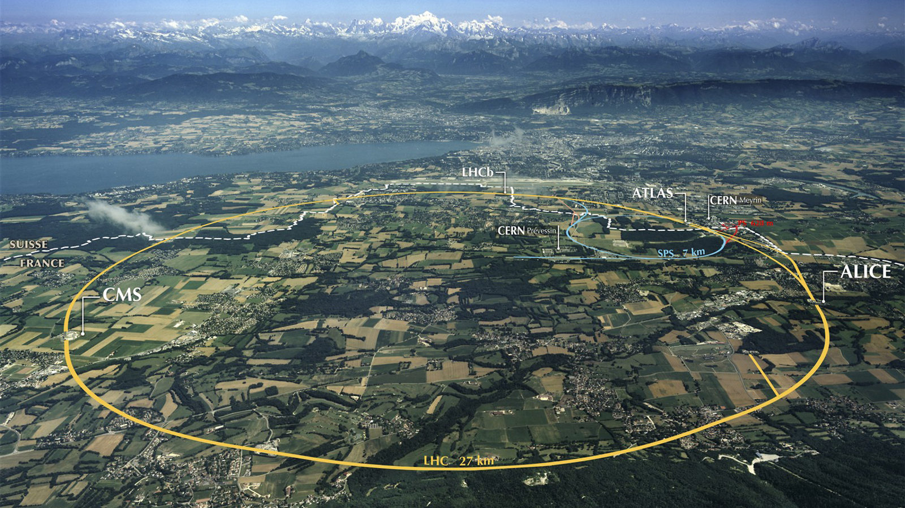
   </a>

.caption[LHC]
]
.kol-1-2.center[

   <a href="https://atlas.cern/">
      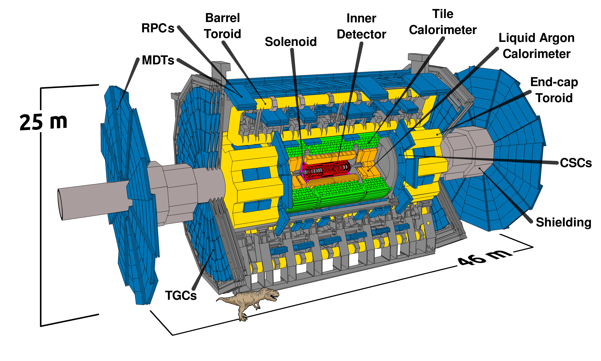
   </a>

.caption[ATLAS]
]
.kol-1-1[
.kol-1-2.center[

   <a href="https://twitter.com/HEPfeickert/status/1269406145858469891?s=20">
      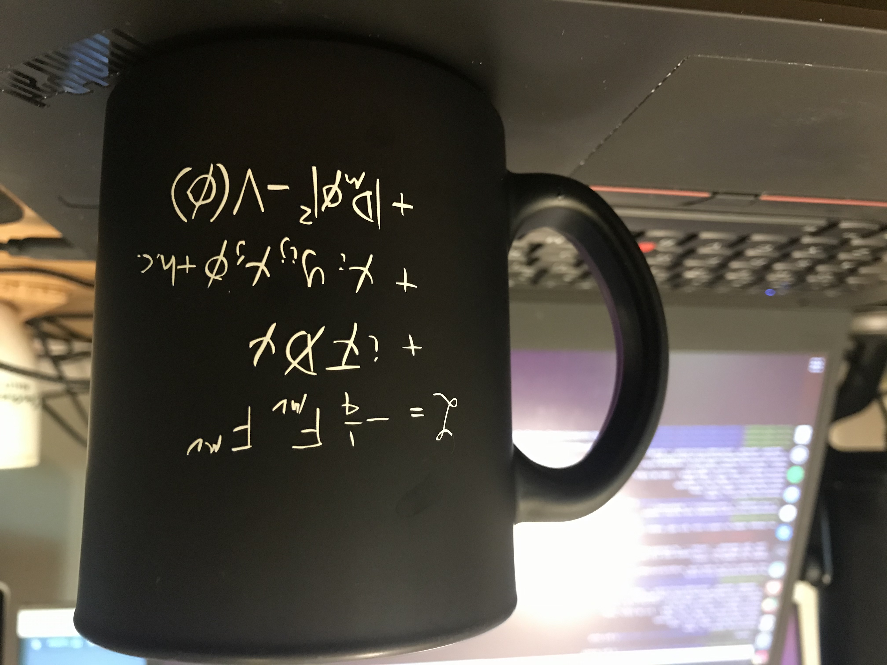
   </a>

]
.kol-1-2.center[
.kol-1-2.center[

   

]
.kol-1-2.center[

   <a href="https://twitter.com/HEPfeickert/status/1269406145858469891?s=20">
      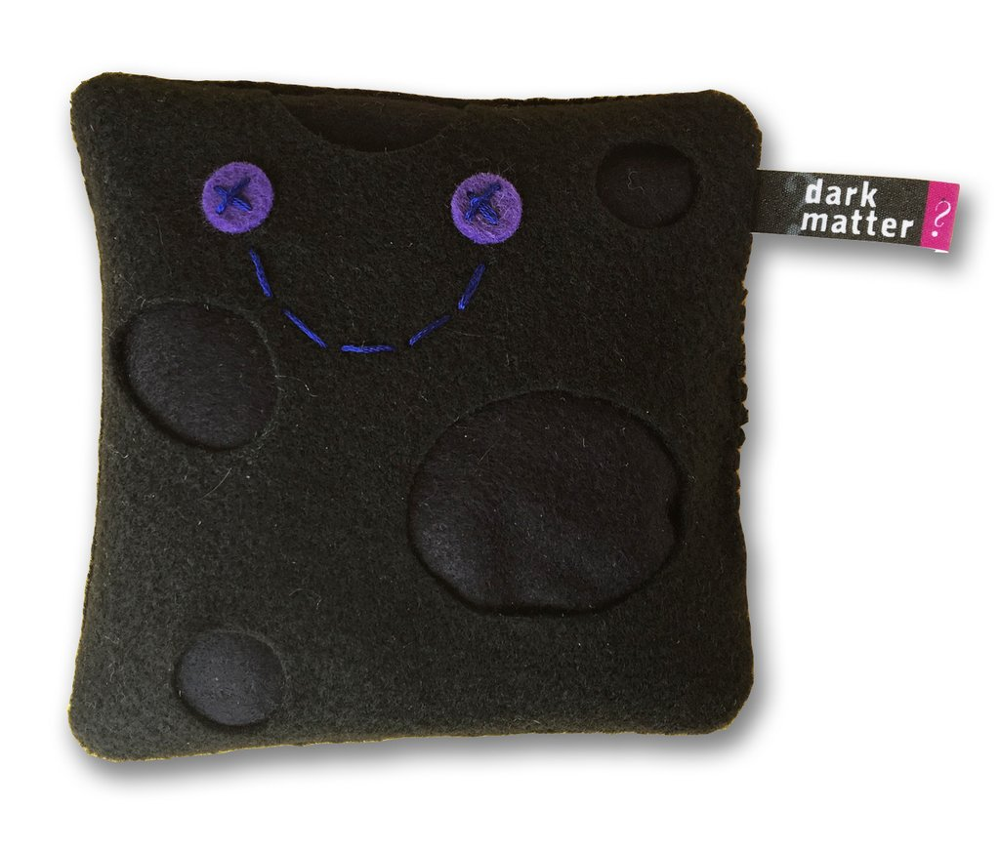
   </a>

]
]
]

---
# High Energy Physics at the LHC

.kol-1-2.center[

   <a href="https://howlargeisthelhc.com/">
      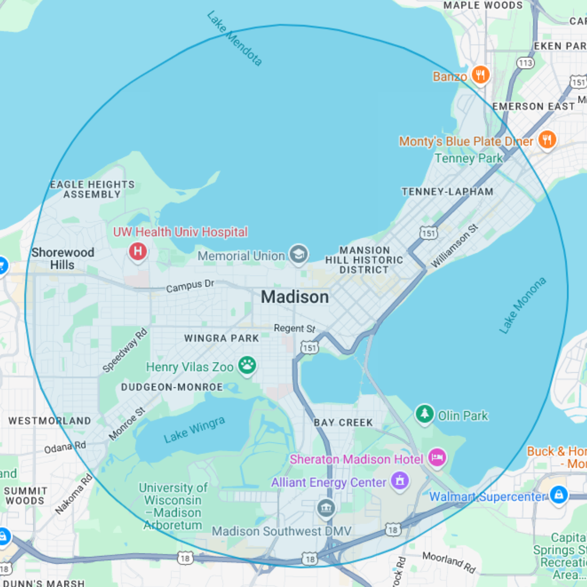
   </a>

.caption[LHC]
]
.kol-1-2.center[

   

.caption[ATLAS]
]
.kol-1-1[
.kol-1-2.center[

   

]
.kol-1-2.center[
.kol-1-2.center[

   

]
.kol-1-2.center[

   

]
]
]

---
# High Energy Physics at the LHC

   <!-- original dimensions: https://videos.cern.ch/record/2298073
   width = 560, height-315  -->
   <iframe scrolling="no"  src="https://videos.cern.ch/video/ATLAS-VIDEO-2023-013-001?autoplay=1&loop=1" width="840" height="473" frameborder="0" allowfullscreen></iframe>

.center[[Animated ATLAS event display of simulated new physics (.italic[Phys. Lett. B 848 (2024) 138324])](https://atlaspo.cern.ch/public/event_display/)]

---
# High Energy Physics at the LHC

.kol-3-5[
.large[
* LHC beam crossing at experiments every .bold[25 ns]  (.bold[40 MHz] collisions)
   - Would translate to around 100 terabytes per second ⚠️
   - Use real time data processing ("trigger") system to only keep potentially interesting collisions
   - Use further physics specific selections before writing to disk to reduce data stream even more
* Translates to roughly .bold[90 petabytes] of collision data recorded per year
<!-- * LHC Run 2 produced data set 5x that used for the 2012 Higgs discovery -->
* LHC data taking scheduled to continue for another roughly .bold[20 years]
   - Majority of data is yet to come!
   - The roughly 10% taken already challenging
]
]
.kol-2-5[

   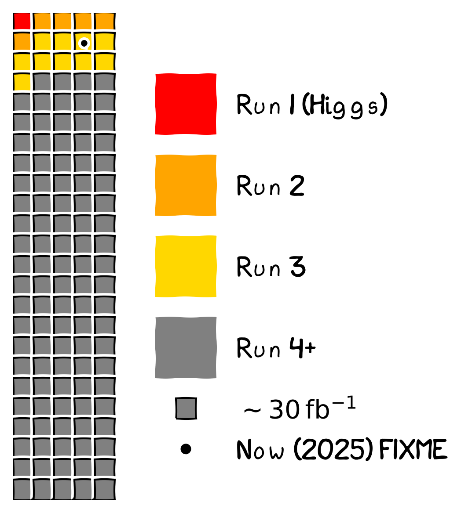
.center[Planned (HL-)LHC lifetime data collection]

]

---
# Opportunities and Challenges of the HL-LHC
<!--  -->

   <a href="https://hilumilhc.web.cern.ch/content/hl-lhc-project">
      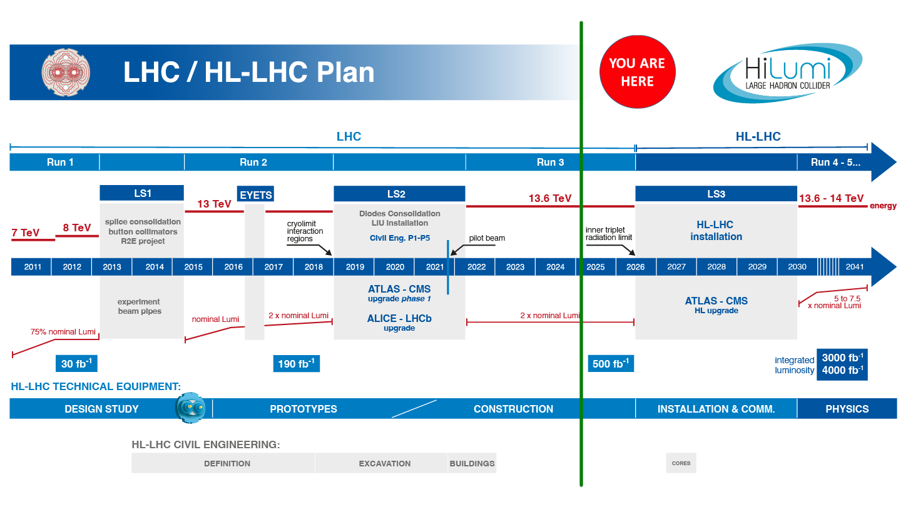
   </a>
   

<!--  -->
.large[
* Increase in data generating collision rate ("luminosity") of roughly order of magnitude
   - Factor of .bold[20-25] times the amount of collisions delivered from Run-2 of the LHC
* Boon for measurements constrained by statistical uncertainties, searches for rare processes
]

---
# Opportunities and Challenges of the HL-LHC

.center.large[Challenge to be able to .bold[record, store, and analyze] the data]

   <a href="https://cds.cern.ch/record/2802918">
      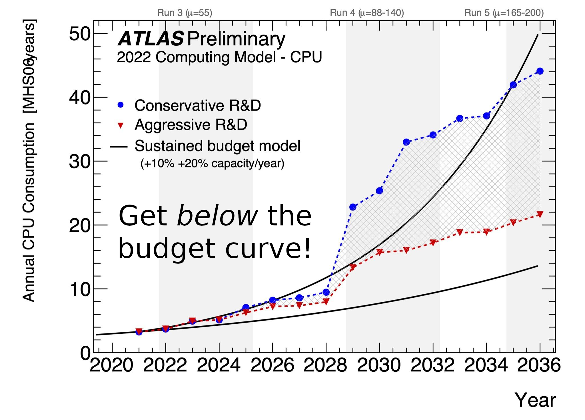
   </a>

<!-- .center[[ATLAS software and computing review](https://cds.cern.ch/record/2802918)] -->

.center.large[Projected .bold[required compute usage] for HL-LHC (want .blue[R]&.red[D] below .black[budget] line)]

---
# Planned investment for the next decades
<!--
.bold.center.large[Exciting future for all these areas in particle physics with large scale investment!] -->

.kol-1-3[

   <a href="https://www.usparticlephysics.org/2023-p5-report/">
      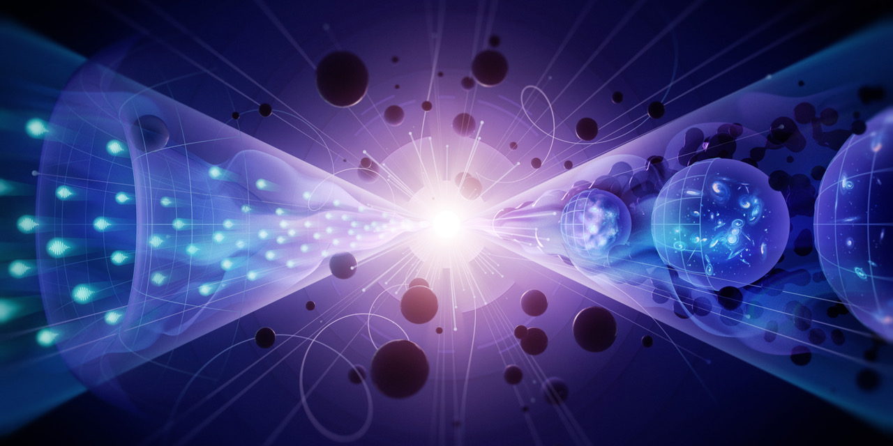
   </a>

.center[[Report of the 2023 Particle Physics Project Prioritization Panel](https://www.usparticlephysics.org/2023-p5-report/)]

Once a decade formal recommendations from US particle physics community to .bold[US Congress and funding agencies]

I served on the Formation Task Force for the Coordinating Panel for Software and Computing
]
.kol-2-3[

   <a href="https://www.usparticlephysics.org/2023-p5-report/">
      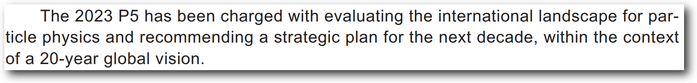
   </a>

   <a href="https://www.usparticlephysics.org/2023-p5-report/">
      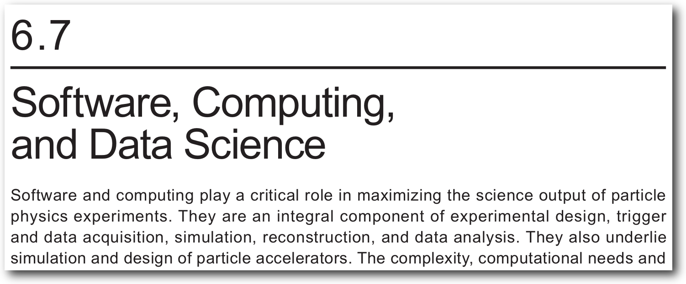
   </a>

   <a href="https://www.usparticlephysics.org/2023-p5-report/">
      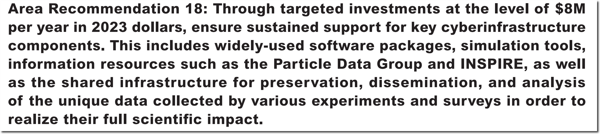
   </a>

]

<!-- .center.huge[Recommendations for AI/ML] -->

---
# Planned investment for the next decades

.kol-1-3[

   

.center[[Report of the 2023 Particle Physics Project Prioritization Panel](https://www.usparticlephysics.org/2023-p5-report/)]

Once a decade formal recommendations from US particle physics community to .bold[US Congress and funding agencies]

I served on the Formation Task Force for the Coordinating Panel for Software and Computing
]
.kol-2-3[

   

   <a href="https://www.usparticlephysics.org/2023-p5-report/">
      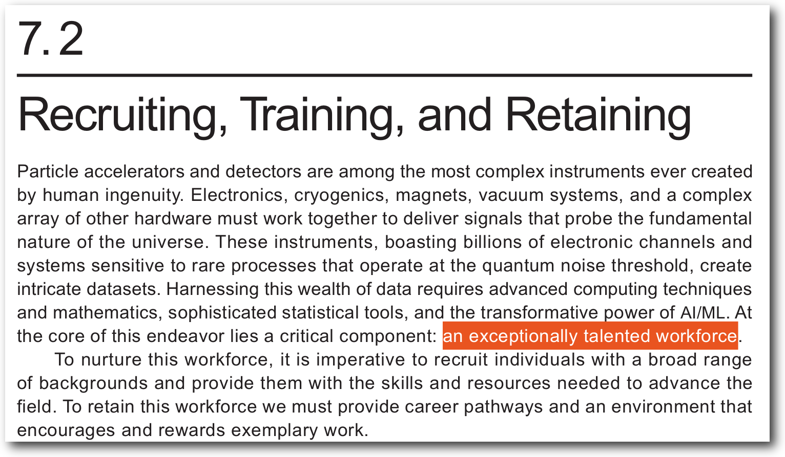
   </a>

]

.center.huge[In both research and people]

---
# IRIS-HEP

.large[.bold[Execute R&D activities] required to close the HL-LHC software and computing gaps and serve as .bold[intellectual hub for larger community]]

.kol-3-5[
.huge.bold[[HL-LHC Software and Computing Gaps](https://inspirehep.net/literature/2628983)]
.huge[
1. Raw resource gaps

2. Scalability of the distributed computing cyberinfrastructure

3. Analysis at scale

4. Sustainability
]
]
.kol-2-5[

   

.center.large[Institute for Research and Innovation in Software for High Energy Physics (IRIS-HEP)]

.center[Supported by the National Science Foundation Cooperative Agreements  [OAC-1836650](https://www.nsf.gov/awardsearch/showAward?AWD_ID=1836650) and [PHY-2323298](https://www.nsf.gov/awardsearch/showAward?AWD_ID=2323298)
]
]

---
# IRIS-HEP

   <a href="https://iris-hep.org/about/team">
      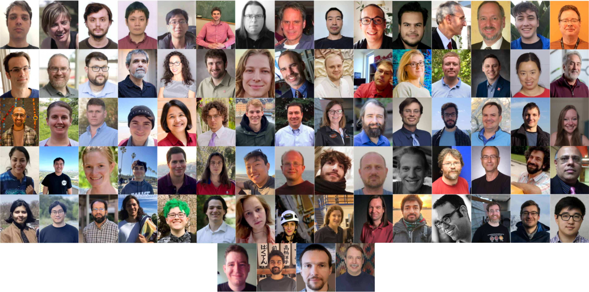
   </a>
.center.large[Distributed team of professional physicists, computer scientists, software developers,  research software engineers, professors, and Ph.D. students from 20 institutions!]

---
# IRIS-HEP (UW-Madison)

   <a href="https://iris-hep.org/about/team">
      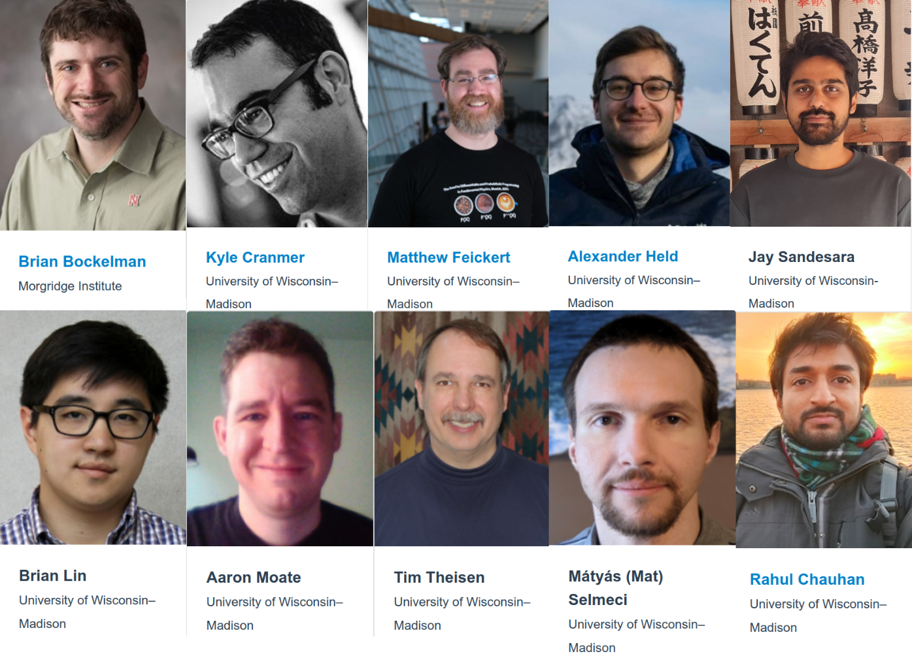
   </a>
.center.large[Proud UW-Madison + Morgridge have .bold[large leadership roles and impact] in IRIS-HEP]

---
# IRIS-HEP

.kol-1-1[
.kol-1-2[
.huge[
Designed around [focus areas](https://inspirehep.net/literature/2628983)
]
.large[
* Intellectual Hub
* .bold[Analysis Systems]
* Data Organization, Management, and Access (DOMA)
* Innovative Algorithms
* Translational Research for AI
* Scalable Systems Laboratory (SSL)
* OSG Services for LHC (OSG-LHC)
]
]
.kol-1-2[
 

   <a href="https://iris-hep.org/">
      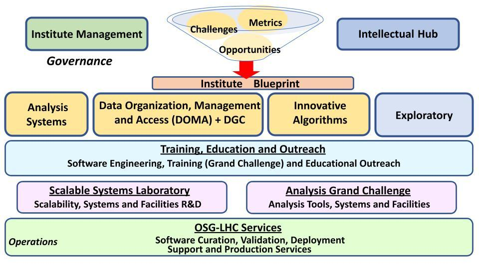
   </a>

.caption[IRIS-HEP Institute Structure]
]
]

.large[
community engagement with .bold[training, education, and outreach] and .bold[institute grand challenges]
]

---
# Education and Training of Next Generation
<!-- * Emphasize Fellows, trainings, TAC-HEP, URSSI Fellowship teaching, that the P5 has an explicit section on training and work force development
* Big part -->

.kol-1-2[

   <a href="https://iris-hep.org/fellows.html">
      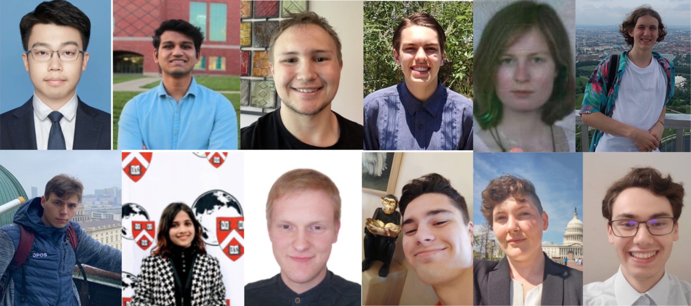
   </a>

.caption[IRIS-HEP [Fellows Program](https://iris-hep.org/fellows.html)]
]
.kol-1-2[

   <a href="https://indico.cern.ch/event/1376945/">
      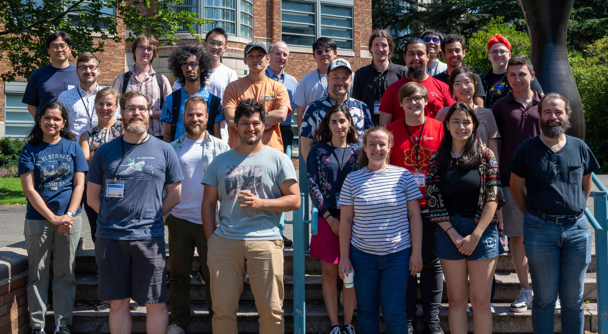
   </a>

.caption[[US ATLAS](https://indico.cern.ch/event/1376945/) and [US CMS](https://indico.cern.ch/event/1383972/) / IRIS-HEP Analysis Software Training Events]
]
.kol-1-2[

   <a href="https://indico.cern.ch/event/1293313/">
      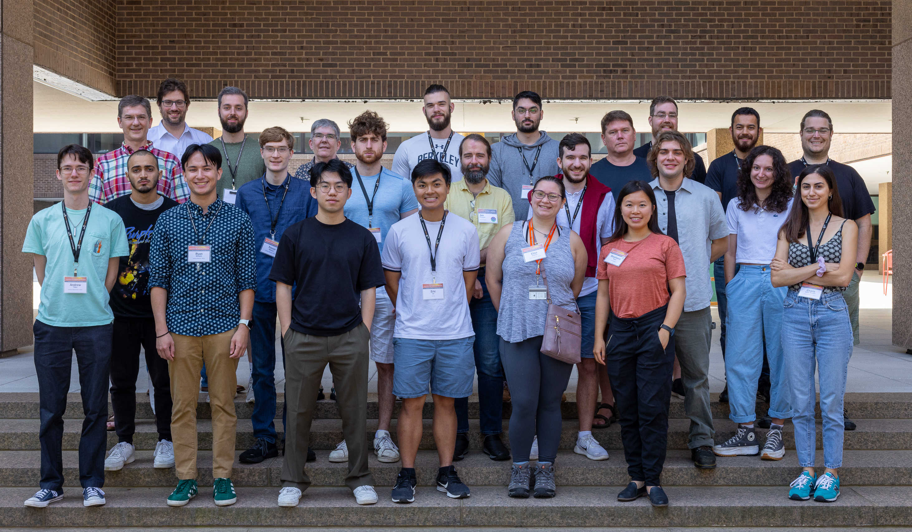
   </a>

.caption[Training to Advance Computational High Energy Physics in the Exascale Era ([TAC-HEP](https://tac-hep.org/)) [Lectures](https://indico.cern.ch/event/1293313/)]
]
.kol-1-2[

   <a href="https://urssi.us/blog/">
      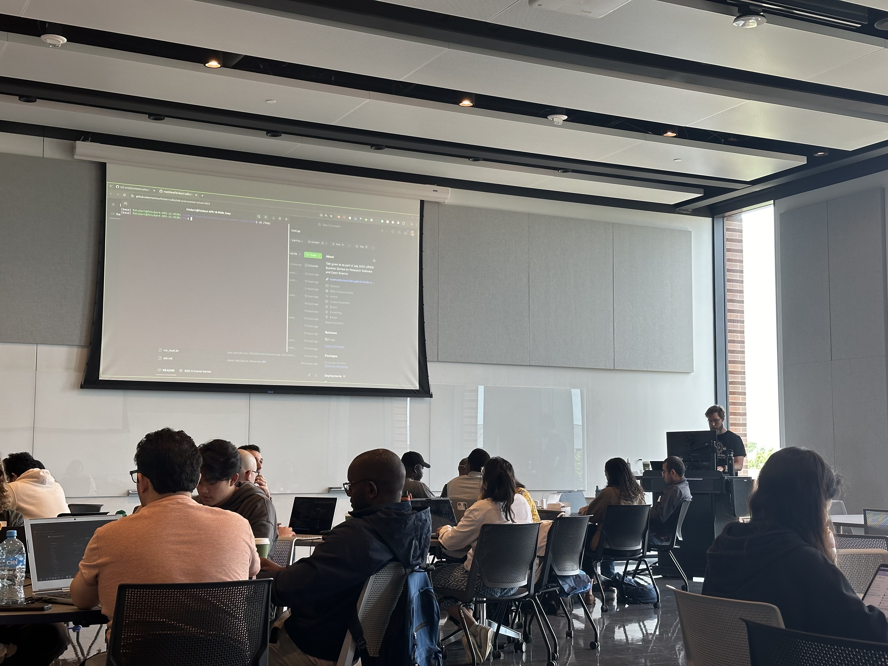
   </a>

.caption[US Research Software Sustainability Institute (URSSI) Early-Career Fellowship: [Reproducible Machine Learning Workflows for Scientists](https://urssi.us/blog/)]
]

---
# Education and Training of Next Generation

   <a href="https://x.com/SMUPhysics/status/861584474638766080">
      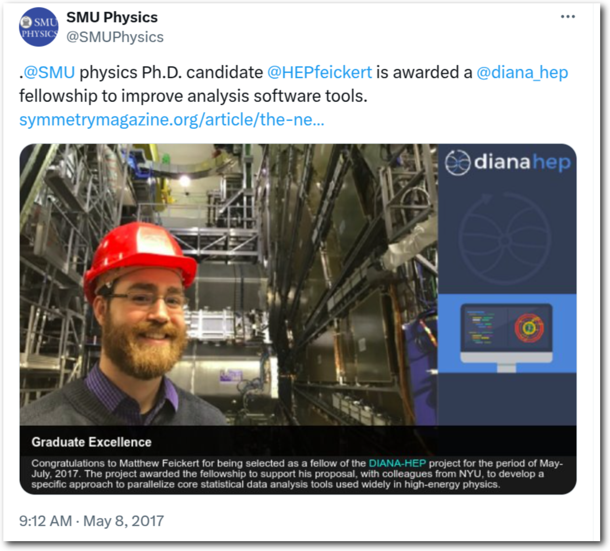
   </a>

.center.huge[Training programs personally relevant, as they .bold[heavily impacted my career] 
2017 DIANA/HEP Fellow mentored by Kyle Cranmer
]

<!-- https://github.com/iris-hep/analysis-grand-challenge/blob/382e512d39e9b62fc4d9da2c69e454dfc718c5f6/docs/index.rst#more-details-what-is-being-investigated-in-the-agc-context -->
---
# IRIS-HEP Analysis Systems

   <a href="https://iris-hep.org/as.html">
      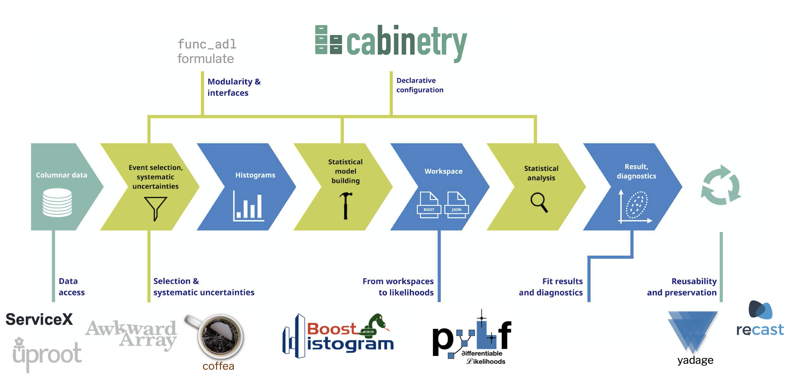
   </a>

.huge[
* Deployable analysis pipelines that .bold[reduce physicist time-to-insight]
   - Tools integrate into the broader scientific Python computing ecosystem
* Analysis reuse as deployment feature
]

---
# IRIS-HEP Analysis Systems

   <a href="https://github.com/iris-hep/analysis-grand-challenge/blob/382e512d39e9b62fc4d9da2c69e454dfc718c5f6/docs/taskbackground.rst">
      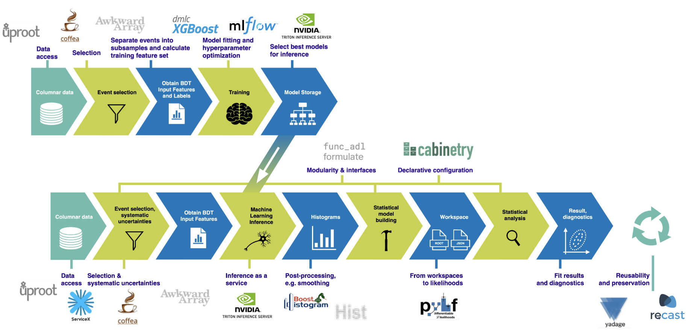
   </a>

.huge.center[
Integrating [machine learning training and inference](https://indico.jlab.org/event/459/contributions/11692/) into analysis workflows
]

---
# Analysis Grand Challenge: 200 Gbps challenge

.footnote[[The 200 Gbps Challenge: Imagining HL-LHC analysis facilities](https://indico.cern.ch/event/1338689/contributions/6009824/), A. Held, et al.]
.kol-3-5.larger[
.bold.center[end-user analysis vision]

* Analyze O(1000) TB of data within a few hours
* .blue[Interactive analysis turnaround: "coffee break" timescale]
* Fully integrated Analysis Facilities
* UX to empower big and small teams
* Easy access to state-of-the-art ML + techniques
* Reproducibility, analysis preservation, reuse
]
.kol-2-5[

   <a href="https://indico.cern.ch/event/1338689/contributions/6009824/">
      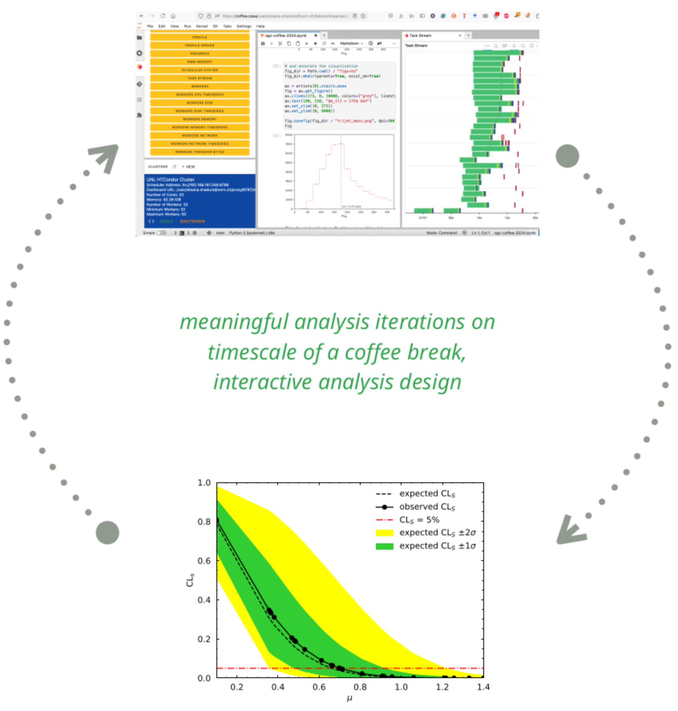
   </a>

]

---
# Analysis Grand Challenge: 200 Gbps challenge

.footnote[[The 200 Gbps Challenge: Imagining HL-LHC analysis facilities](https://indico.cern.ch/event/1338689/contributions/6009824/), A. Held, et al.]
.kol-3-5.larger[
.bold.center[end-user analysis vision]

* Analyze O(1000) TB of data within a few hours
* Interactive analysis turnaround: "coffee break" timescale
* Fully integrated Analysis Facilities
* UX to empower big and small teams
* .blue[Easy access to state-of-the-art ML + techniques]
* Reproducibility, analysis preservation, reuse
]
.kol-2-5[

   <a href="https://indico.cern.ch/event/1338689/contributions/6009824/">
      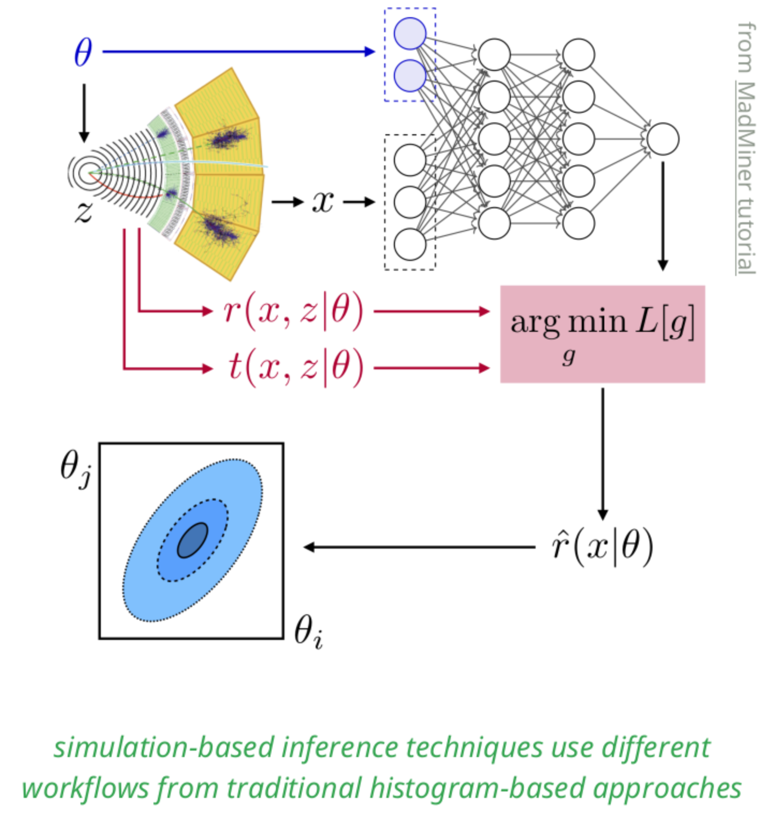
   </a>

]

---
# Analysis Grand Challenge: 200 Gbps challenge

.kol-1-1[
.kol-1-2[

   <a href="https://indico.cern.ch/event/1338689/contributions/6009824/">
      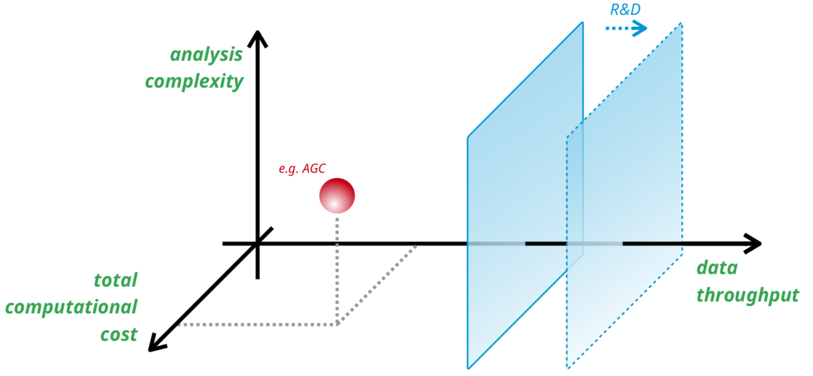
   </a>

]
.kol-1-2.larger[
AGC is a .bold[multidimensional] challenge 
First axis attacked is .bold[data throughput] 
200 Gbps: process 180 TB dataset in 30 minutes
]
]

.kol-1-1[
.kol-1-2[

   <a href="https://indico.cern.ch/event/1338689/contributions/6009824/">
      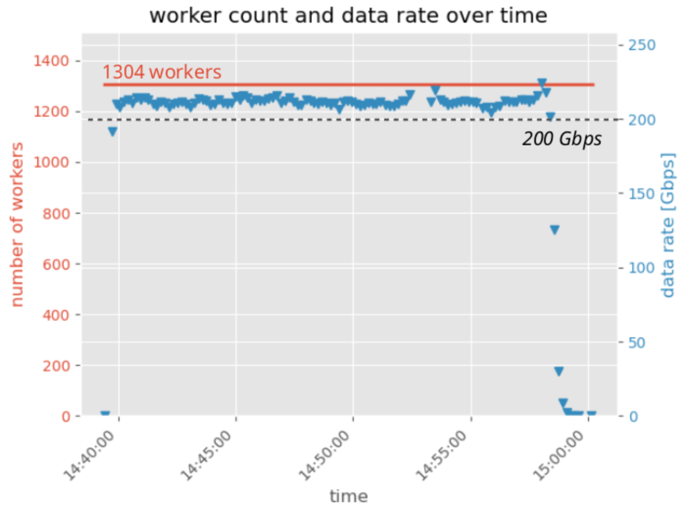
   </a>

.center[CMS NanoAOD on .bold[Nebrasksa Coffea-casa]]
]
.kol-1-2[

   <a href="https://indico.cern.ch/event/1338689/contributions/6009824/">
      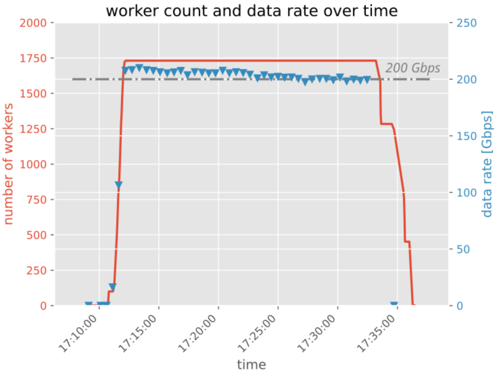
   </a>

.center[ATLAS PHYSLITE on .bold[UChicago Analysis Facility]]
]
]

---
# Analysis Grand Challenge: 200 Gbps challenge

.kol-1-2[

   <a href="https://indico.cern.ch/event/1338689/contributions/6009824/">
      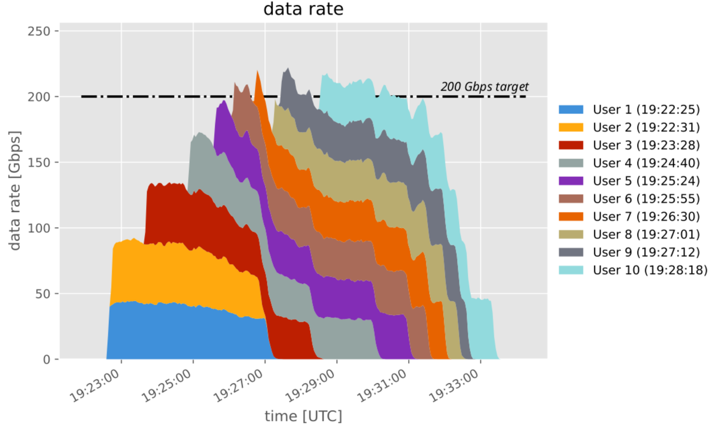
   </a>

Multiuser runs of the AGC show we can still .bold[reach 200 Gbps in aggregate]
* Limited to 200 cores per user
* Enough throughput to hit .bold[network saturation] at UChicago AF
]
.kol-1-2[

   <a href="https://indico.cern.ch/event/1338689/contributions/6009824/">
      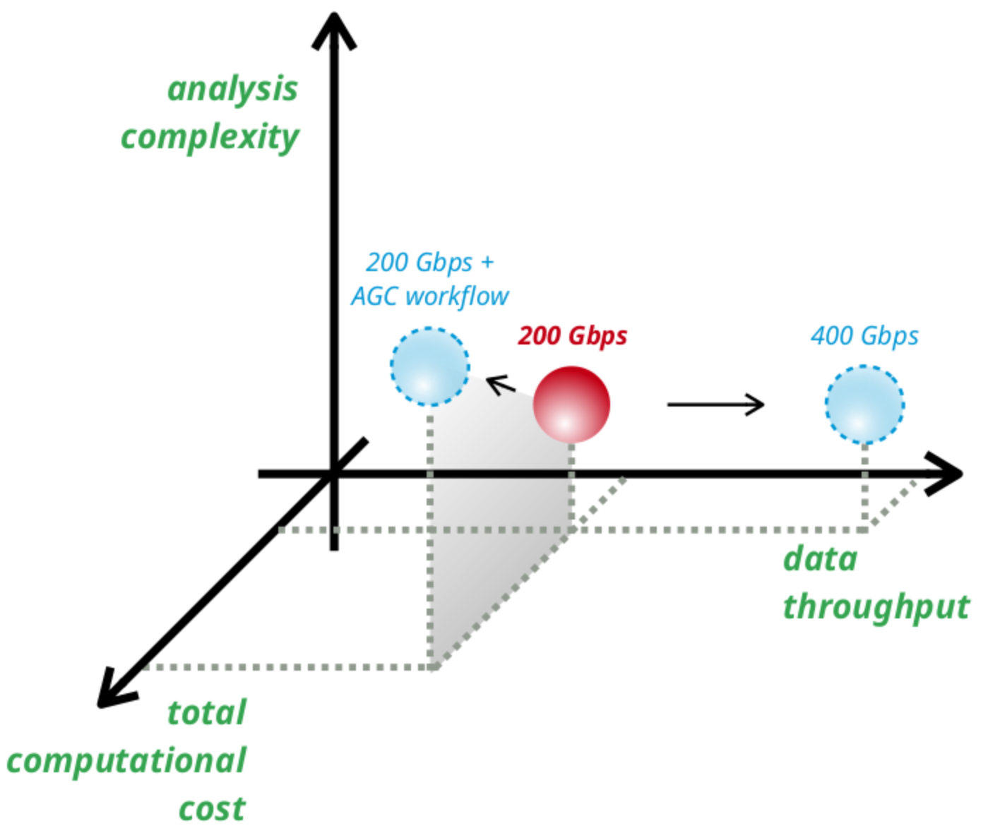
   </a>

.bold.center[Further explore parameter space of HL-LHC analyses]

   <a href="https://indico.cern.ch/event/1338689/contributions/6009824/">
      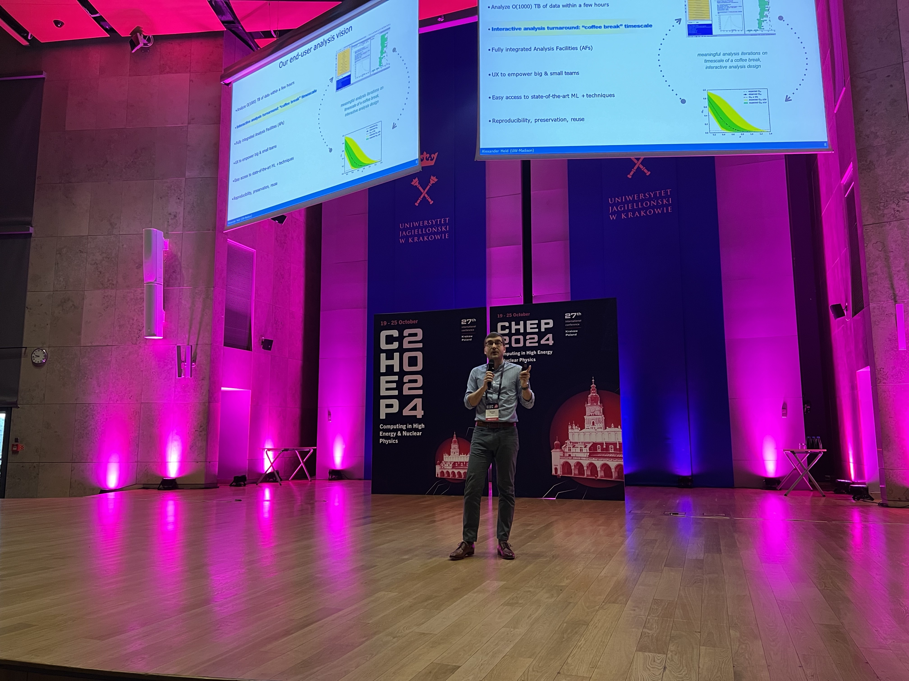
   </a>

.bold.center[200 Gbps keynote at CHEP 2024 by Alexander Held]
]

---
# Automatic differentiation as tool for science

<!-- .footnote[Taking a [slide](https://indico.ph.tum.de/event/7113/contributions/7705/) from Lukas Heinrich] -->

.kol-1-2[

   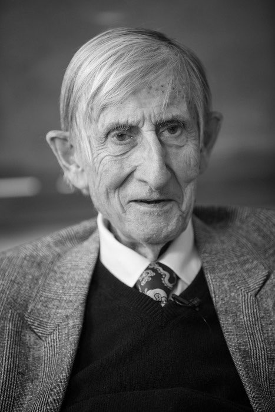

]
.kol-1-2.huge[
  
.bold[New directions in science are launched by new tools much more often than by new concepts.] &mdash; .italic[Imagined Worlds], 1997, Freeman Dyson
]

---
# Gradients as Computational Tools

- As we'll see later, having access to the .bold[gradient] while performing .bold[minimization] is .bold[highly beneficial]!
- Can imagine multiple ways of arriving at gradients for computational functions
   <!-- - But want them to be both .bold[exact] and .bold[flexible] -->

.center.width-30[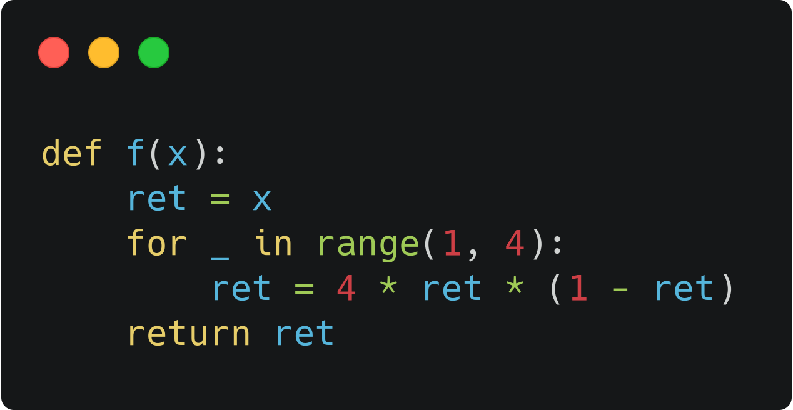]
.kol-6-8[
.bold.center[Symbolic]
.center.width-100[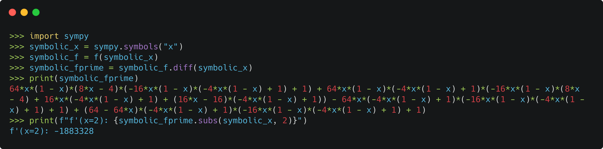]
]
.kol-2-8.huge[
 
- Exact: .blue[Yes]
- Flexible: .red[No]
]

---
# Gradients as Computational Tools

- As we'll see later, having access to the .bold[gradient] while performing .bold[minimization] is .bold[highly beneficial]!
- Can imagine multiple ways of arriving at gradients for computational functions

.center.width-30[]
.kol-6-8[
.bold.center[Numeric]
.center.width-70[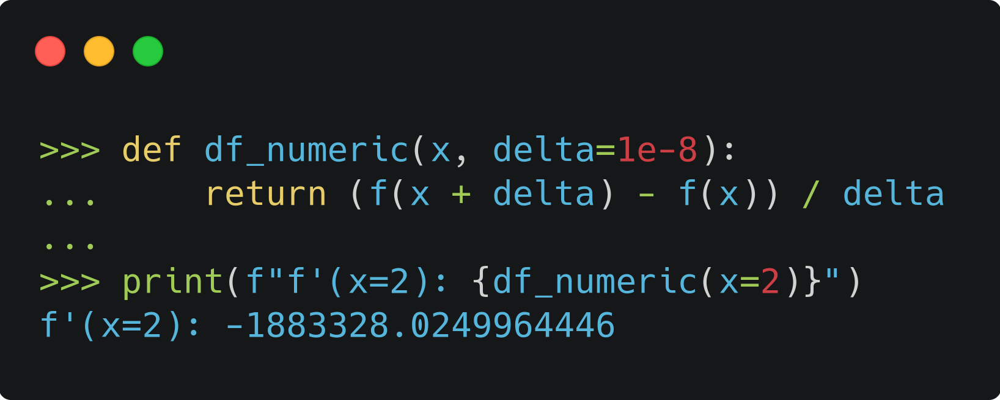]
]
.kol-2-8.huge[
 
- Exact: .red[No]
- Flexible: .blue[Yes]
]

---
# Gradients as Computational Tools

- As we'll see later, having access to the .bold[gradient] while performing .bold[minimization] is .bold[highly beneficial]!
- Can imagine multiple ways of arriving at gradients for computational functions

.center.width-30[]
.kol-6-8[
.bold.center[Automatic]
.center.width-80[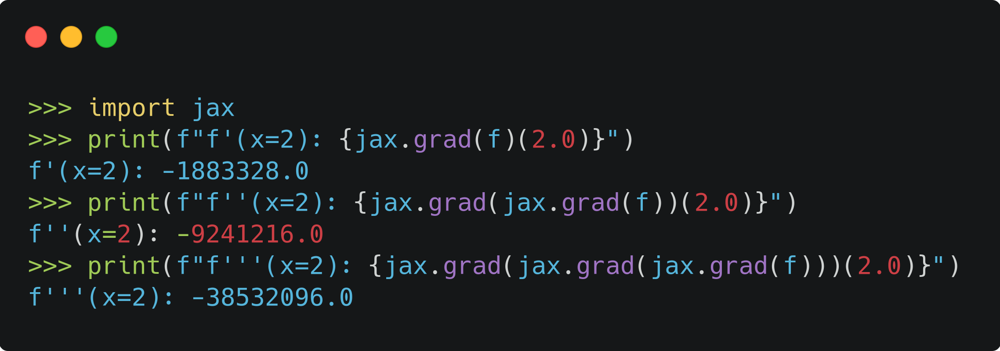]
]
.kol-2-8.huge[
 
- Exact: .blue[Yes]
- Flexible: .blue[Yes]
]

---
# Automatic Differentiation

.kol-3-5[
- Automatic differentiation provides .bold[gradients] of numerical functions for .bold[arbitrary code to machine precision]
- Build computational graph of the calculation
- Nodes represent operations, edges represent flow of gradients
- Apply the chain rule to operations
   - Can traverse the graph in forward or reverse modes depending on the relative dimensions of input and output for efficient computation

$$
f(a,b) = a^{2} \sin(ab)
$$
 
$$
\frac{df}{da} = \frac{\partial c}{\partial a} \frac{\partial f}{\partial c} + \frac{\partial d}{\partial a} \frac{\partial e}{\partial d} \frac{\partial f}{\partial e}
$$
$$
= 2a \sin(ab) + a^{2}b \cos(ab)
$$

<!-- TODO: Revise example with graphviz -->
]
.kol-2-5.center[
.width-100[[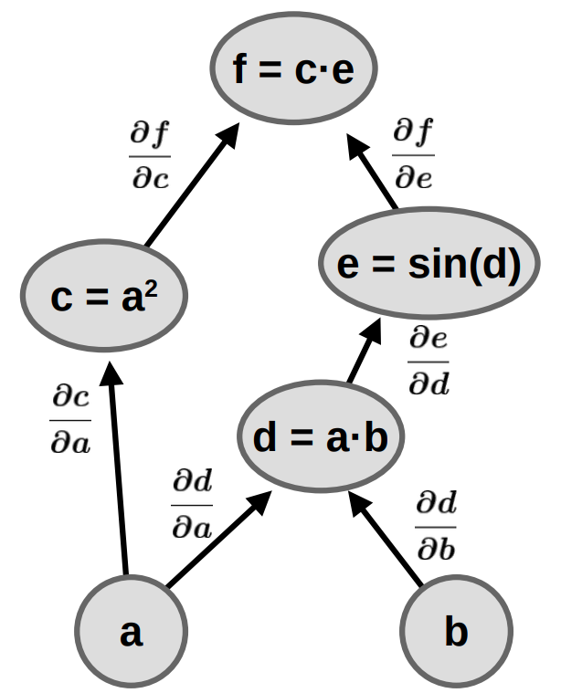](https://indico.cern.ch/event/941278/contributions/4084835/)]
]

---
# Differentiable Programming as AI/ML Tool

<!-- a new kind of software by assembling networks of parameterized functional blocks and by training them from examples using some form of gradient-based optimization -->

.kol-1-2[

   

]
.kol-1-2.huge[
   
.bold[Deep Learning est mort. Vive Differentiable Programming!] &mdash; Yann LeCun, 2018
]

---
# Differentiable Programming as AI/ML Tool

.grid[
.kol-1-2.large[
- Allows writing .bold[fully differentiable programs]
- Resulting system can be .bold[optimized] end-to-end using .bold[efficient gradient-based optimization algorithms]
   - Optimization? That's .bold[ML]!
   - .bold[Deep learning] is searching for optimal algorithm via gradient descent. Bring .bold[to our tools]!
- Enables computation of full gradients and Jacobians
   - Large benefit to statistical inference
- Replace non-differentiable operations with differentiable analogues
   - Binning, sorting, cuts
]
.kol-1-2[
  
.center.width-100[[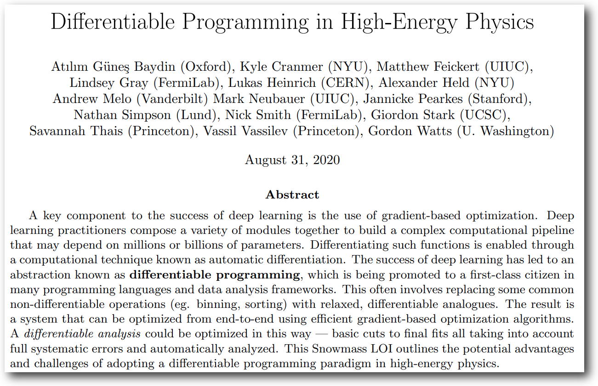](https://www.snowmass21.org/docs/files/summaries/CompF/SNOWMASS21-CompF5_CompF3_Gordon_Watts-046.pdf)]
.center.large[[Snowmass Community Planning Process  2021 Letter of Interest](https://www.snowmass21.org/docs/files/summaries/CompF/SNOWMASS21-CompF5_CompF3_Gordon_Watts-046.pdf)]
]
]

---
# Differentiable Programming as AI/ML Tool

<!-- PINN from https://arxiv.org/abs/2410.14760 -->

 

   <a href="https://www.facebook.com/yann.lecun/posts/10155003011462143">
      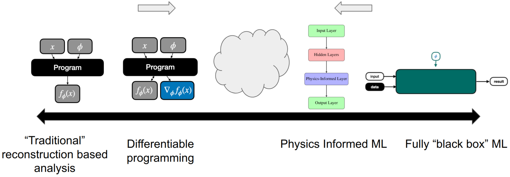
   </a>

<!-- .center.huge[Converge on the representations that best address problems] -->
<!-- .center.huge[Different representations can address different problems.] -->
.center.huge[Automatic differentiation and differentiable programming fundamentally drive all the ML at scale. Time do to this at the scale of physics.]

---
class: focus-slide, center
# Case study:  Automatic differentiation improving analyses

.huge.bold.center[Application of differentiable programming in `pyhf`]

---
# Goals of physics analysis at the LHC

.kol-1-1[
.kol-1-3.center[
.width-100[[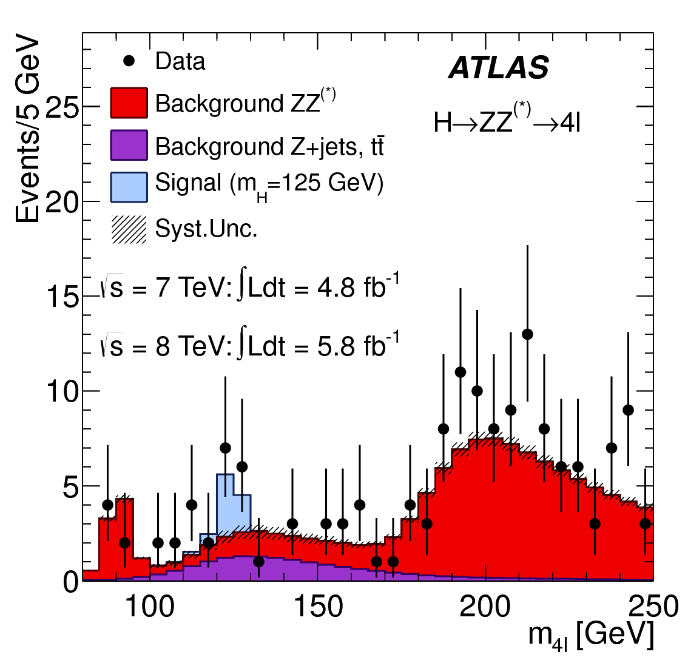](https://atlas.web.cern.ch/Atlas/GROUPS/PHYSICS/PAPERS/HIGG-2012-27/)]
Search for new physics
]
.kol-1-3.center[
 
.width-100[[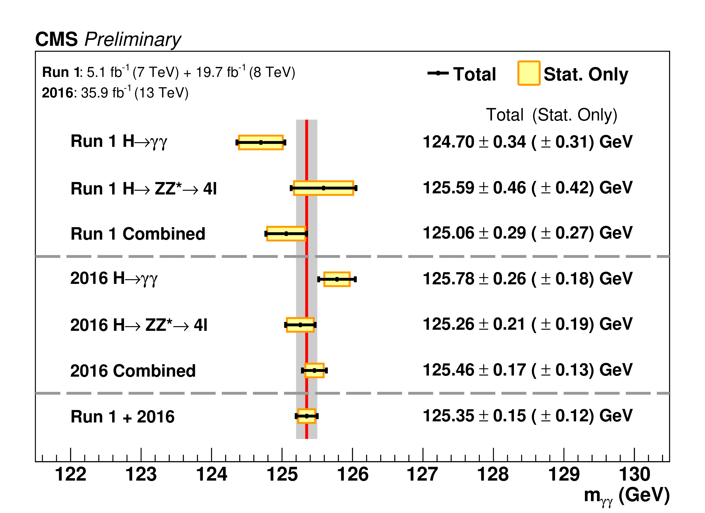](http://cms-results.web.cern.ch/cms-results/public-results/superseded/HIG-19-004/index.html)]

 
Make precision measurements
]
.kol-1-3.center[
.width-110[[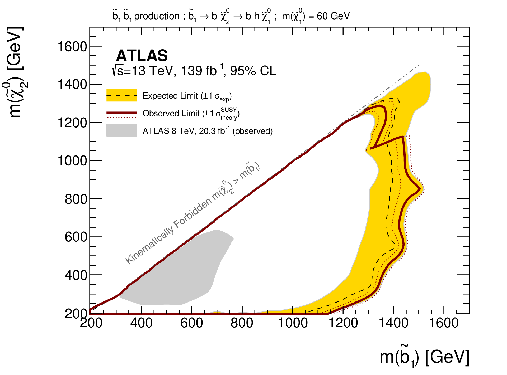](https://atlas.web.cern.ch/Atlas/GROUPS/PHYSICS/PAPERS/SUSY-2018-31/)]

Provide constraints on models through setting best limits
]
]

- All require .bold[building statistical models] and .bold[fitting models] to data to perform statistical inference
- Model complexity can be huge for complicated searches
- **Problem:** Time to fit can be .bold[many hours]
- .blue[Goal:] Empower analysts with fast fits and expressive models

---
# HistFactory Model

$$
f\left(\mathrm{data}\middle|\mathrm{parameters}\right) =  f\left(\textcolor{#00a620}{\vec{n}}, \textcolor{#a3130f}{\vec{a}}\middle|\textcolor{#0495fc}{\vec{\eta}}, \textcolor{#9c2cfc}{\vec{\chi}}\right) = \prod\_{c \\,\in\\, \textrm{channels}} \prod\_{b \\,\in\\, \textrm{bins}\_c} \textrm{Pois} \left(\textcolor{#00a620}{n\_{cb}} \middle| \nu\_{cb}\left(\textcolor{#0495fc}{\vec{\eta}}, \textcolor{#9c2cfc}{\vec{\chi}}\right)\right) \prod\_{\chi \\,\in\\, \vec{\chi}} c\_{\chi} \left(\textcolor{#a3130f}{a\_{\chi}}\middle|\textcolor{#9c2cfc}{\chi}\right)
$$

.center[$\textcolor{#00a620}{\vec{n}}$: .obsdata[events], $\textcolor{#a3130f}{\vec{a}}$: .auxdata[auxiliary data], $\textcolor{#0495fc}{\vec{\eta}}$: .freepars[unconstrained pars], $\textcolor{#9c2cfc}{\vec{\chi}}$: .conpars[constrained pars]]

$$
\nu\_{cb}(\textcolor{#0495fc}{\vec{\eta}}, \textcolor{#9c2cfc}{\vec{\chi}}) = \sum\_{s \\,\in\\, \textrm{samples}} \underbrace{\left(\sum\_{\kappa \\,\in\\, \vec{\kappa}} \kappa\_{scb}(\textcolor{#0495fc}{\vec{\eta}}, \textcolor{#9c2cfc}{\vec{\chi}})\right)}\_{\textrm{multiplicative}} \Bigg(\nu\_{scb}^{0}(\textcolor{#0495fc}{\vec{\eta}}, \textcolor{#9c2cfc}{\vec{\chi}}) + \underbrace{\sum\_{\Delta \\,\in\\, \vec{\Delta}} \Delta\_{scb}(\textcolor{#0495fc}{\vec{\eta}}, \textcolor{#9c2cfc}{\vec{\chi}})}\_{\textrm{additive}}\Bigg)
$$

Mathematical grammar for a simultaneous fit with multiple disjoint _channels_ (or regions) of binned distributions with multiple _samples_ contributing to each with additional (possibly shared) systematics between sample estimates

<!-- .center[.bold[This is a _mathematical_ representation!] Nowhere is any software spec defined] -->
.center[.bold[Until 2018] the only implementation of HistFactory was in `C++` framework for physics analysis ([`ROOT`](https://root.cern.ch/))]

   <a href="https://root.cern/doc/v628/group__HistFactory.html">
      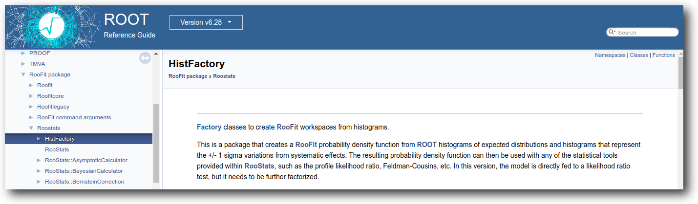
   </a>

---
# `pyhf`: HistFactory in pure Python

.kol-1-1[
.kol-1-2.large[
- First non-`C++`/ROOT implementation of the HistFactory p.d.f. template
.width-40[] .width-40[]
- pure-Python library as second implementation of HistFactory
  - [`$ python -m pip install pyhf`](https://scikit-hep.org/pyhf/installation.html#install-from-pypi)
  <!-- - [`$ micromamba install -c conda-forge pyhf`](https://prefix.dev/channels/conda-forge/packages/pyhf) -->
  - No dependence on large `C++` ROOT framework!
]
.kol-1-2.large[
- Open source tool for all of HEP
   - [IRIS-HEP](https://iris-hep.org/projects/pyhf.html) supported Scikit-HEP project
   - Used in ATLAS HMBS, Exotics, and Top physics groups in [.bold[over 40 published analyses]](https://scikit-hep.org/pyhf/citations.html#published-statistical-models)
   - [Used by](https://scikit-hep.org/pyhf/citations.html#use-citations) flavor physics ([Belle II](https://inspirehep.net/literature/1860766)), neutrino physics ([MicroBooNE](https://arxiv.org/abs/2310.07660)), phenomenology community ([`SModelS`](https://inspirehep.net/literature/1814793)), future collider studies ([EIC](https://inspirehep.net/literature/1846026), [MuC](https://inspirehep.net/literature/2743639))
   <!-- ([`SModelS`](https://inspirehep.net/literature/1814793), [`MadAnalysis 5`](https://inspirehep.net/literature/2103971)) -->
   <!-- - Expanding to future experiments too! -->
   - 
]
]
<!--  -->
.kol-1-1[
.kol-1-3.center[

   <a href="https://pypi.org/project/pyhf/">
      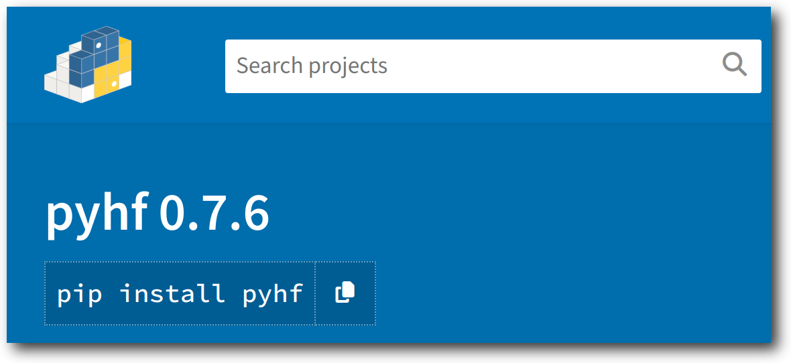
   </a>

]
.kol-2-3[
.grid[
.kol-1-3.center[
.circle.width-70[]

[Lukas Heinrich](https://github.com/lukasheinrich)
]
.kol-1-3.center[
.circle.width-70[]

[Matthew Feickert](https://www.matthewfeickert.com/)
]
.kol-1-3.center[
.circle.width-65[]

[Giordon Stark](https://github.com/kratsg)
]
]
]
]

---
# `pyhf`: HistFactory in pure Python

.kol-1-1[
.kol-1-2.large[
- First non-`C++`/ROOT implementation of the HistFactory p.d.f. template
.width-40[] .width-40[]
- pure-Python library as second implementation of HistFactory
  - [`$ python -m pip install pyhf`](https://scikit-hep.org/pyhf/installation.html#install-from-pypi)
  <!-- - [`$ micromamba install -c conda-forge pyhf`](https://prefix.dev/channels/conda-forge/packages/pyhf) -->
  - No dependence on large `C++` ROOT framework!
]
.kol-1-2.large[
- Open source tool for all of HEP
   - [IRIS-HEP](https://iris-hep.org/projects/pyhf.html) supported Scikit-HEP project
   - Used in ATLAS HMBS, Exotics, and Top physics groups in [.bold[over 40 published analyses]](https://scikit-hep.org/pyhf/citations.html#published-statistical-models)
   - [Used by](https://scikit-hep.org/pyhf/citations.html#use-citations) flavor physics ([Belle II](https://inspirehep.net/literature/1860766)), neutrino physics ([MicroBooNE](https://arxiv.org/abs/2310.07660)), phenomenology community ([`SModelS`](https://inspirehep.net/literature/1814793)), future collider studies ([EIC](https://inspirehep.net/literature/1846026), [MuC](https://inspirehep.net/literature/2743639))
   <!-- ([`SModelS`](https://inspirehep.net/literature/1814793), [`MadAnalysis 5`](https://inspirehep.net/literature/2103971)) -->
   <!-- - Expanding to future experiments too! -->
   - 
]
]
<!--  -->
.kol-1-1[
.kol-1-3.center[

   

]
<!--  -->
.kol-1-3.center[

   <a href="https://joss.theoj.org/papers/10.21105/joss.02823">
      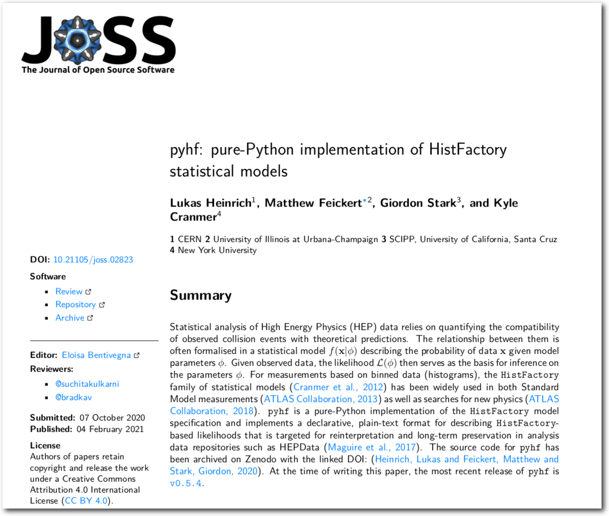
   </a>

]
<!--  -->
.kol-1-3.center[

   <a href="https://inspirehep.net/literature/1845084">
      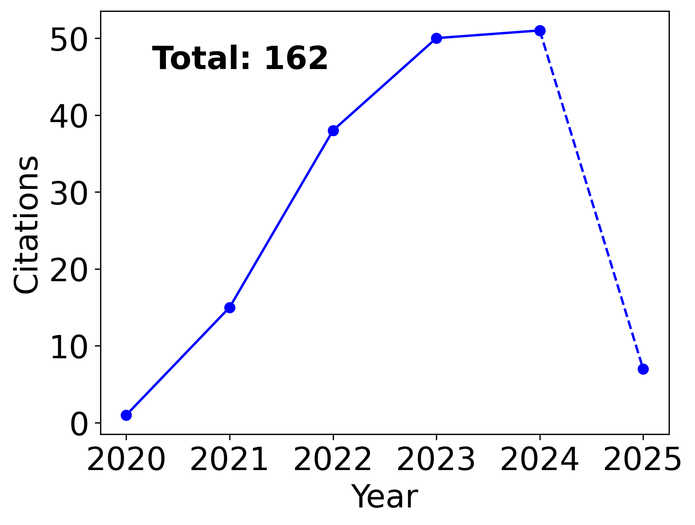
   </a>

]
]

---
# Large community adoption followed
<!-- .center.large.bold[Placeholder slide] -->
.center[
.width-95[[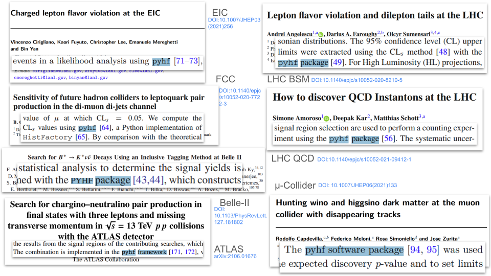](https://scikit-hep.org/pyhf/citations.html)]
]

---
# Machine Learning Frameworks for Computation

.grid[
.kol-2-3[
- All numerical operations implemented in .bold[tensor backends] through an API of $n$-dimensional array operations
- Using deep learning frameworks as computational backends allows for .bold[exploitation of automatic differentiation and GPU acceleration]
- As huge buy in from industry we benefit for free as these frameworks are .bold[continually improved] by professional software engineers (physicists are not)

.kol-1-2.center[
.width-80[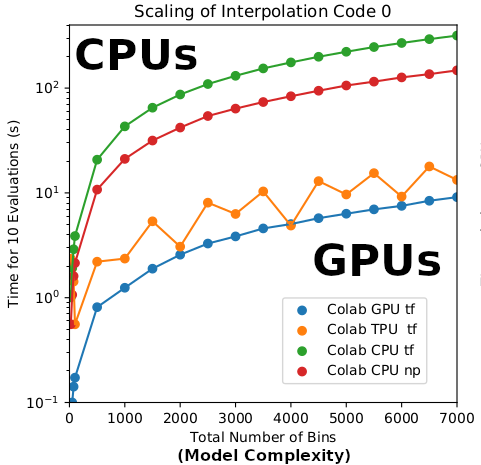]
]
.kol-1-2[
- Hardware acceleration giving .bold[order of magnitude speedup] in interpolation for systematics!
   - does suffer some overhead
- Noticeable impact for large and complex models
   - hours to minutes for fits
]
]
.kol-1-4.center[
.width-85[]
.width-85[]
.width-85[]

 
.width-50[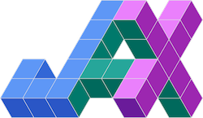]
]
]

---
# Automatic differentiation

With tensor library backends gain access to _exact (higher order) derivatives_ &mdash; accuracy is only limited by floating point precision

$$
\frac{\partial L}{\partial \mu}, \frac{\partial L}{\partial \theta_{i}}
$$

.grid[
.kol-1-2[
.large[Exploit .bold[full gradient of the likelihood] with .bold[modern optimizers] to help speedup fit!]

  
.large[Gain this through the frameworks creating _computational directed acyclic graphs_ and then applying the chain rule (to the operations)]
]
.kol-1-2[

   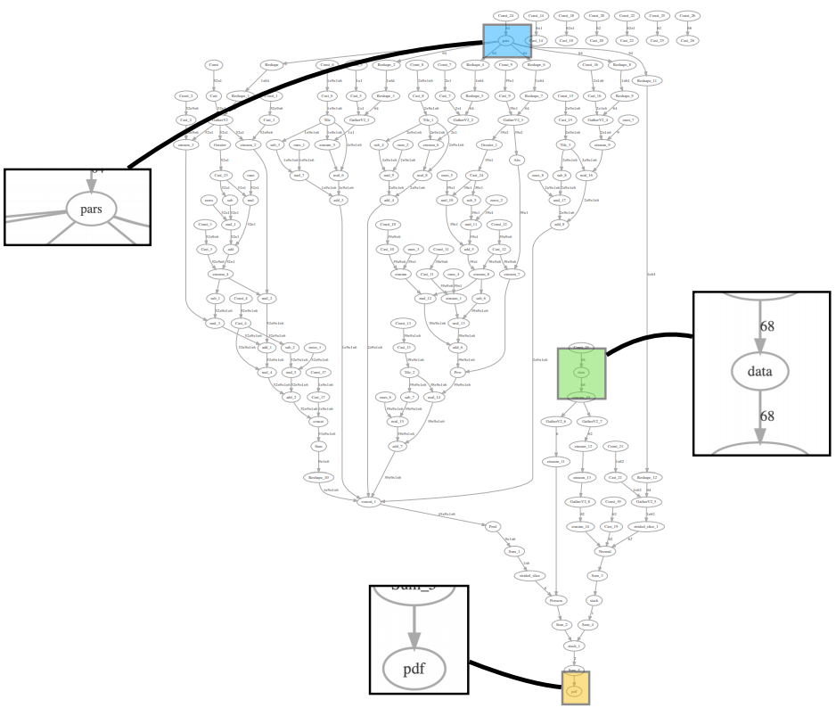

]
]

---
# New Art: Analysis as a Differentiable Program

   <a href="https://inspirehep.net/literature/2050088">
      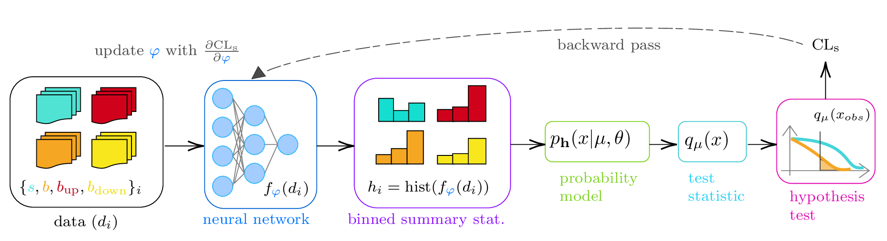
   </a>

.caption[[neos: End-to-End-Optimised Summary Statistics for High Energy Physics](https://inspirehep.net/literature/2050088), Nathan Simpson, Lukas Heinrich]

1. From data $d$ train a neural net with parameters $\varphi$ that produces an observable, $f_{\varphi}(d)$
2. Bin the observable to construct a histogram $h$
3. Build a HistFactory binned statistical model, $p$, from the histograms
4. Perform statistical inference and construct a test statistic, $q$, from hypothesis test
5. Construct monotonic test statistic, $\mathrm{CL}_{s}$, to summarize analysis sensitivity

---
# New Art: Analysis as a Differentiable Program

   

.caption[[neos: End-to-End-Optimised Summary Statistics for High Energy Physics](https://inspirehep.net/literature/2050088), Nathan Simpson, Lukas Heinrich]

.large[
.bold[Goal]: Express final summary statistic as a function of the input data $\mathcal{D}$ and observable parameters $\varphi$ and then optimize analysis sensitivity through back propagating $\partial \,\mathrm{CL_s} / \partial \varphi$ to update $\varphi$
]

$$
\mathrm{CL}_{s} = f(\mathcal{D},\varphi) = (f\textrm{sensitivity} \circ f\textrm{test stat} \circ f \textrm{probability model}  \circ f \textrm{histogram}  \circ f \textrm{observable})(\mathcal{D},\varphi)
$$

<!-- $\mathrm{CL_s} = f(\mathcal{D},\varphi) = (f_{\mathrm{sensitivity}} \circ f_{\mathrm{test\,stat}} \circ f_{\mathrm{likelihood}}  \circ f_{\mathrm{histogram}}  \circ f_{\mathrm{observable}})(\mathcal{D},\varphi)$ -->

.large.bold.center[
Requires all operations to be differentiable
]

---
# New Art: Analysis as a Differentiable Program

   

.caption[[neos: End-to-End-Optimised Summary Statistics for High Energy Physics](https://inspirehep.net/literature/2050088), Nathan Simpson, Lukas Heinrich]

.kol-3-5[
* Histograms are non-differentiable, so use kernel density estimation (KDE) to provide differentiable analouge
   - Accumulate distribution mass in bounds of histogram to construct "binned KDE"
* pyhf is used as able to differentiate constructed likelihood function
   - neos extends pyhf with differentiation of optimization routines
]
.kol-2-5[

   <a href="https://indico.cern.ch/event/882824/timetable/#46-neos-physics-analysis-as-a">
      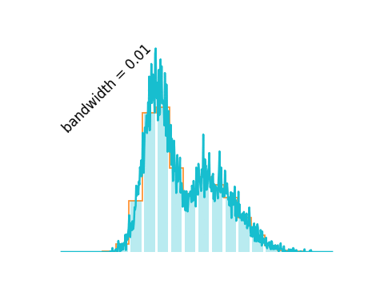
   </a>

]

---
# New Art: Analysis as a Differentiable Program

   

.caption[[neos: End-to-End-Optimised Summary Statistics for High Energy Physics](https://inspirehep.net/literature/2050088), Nathan Simpson, Lukas Heinrich]

1. From data $d$ train a neural net with parameters $\varphi$ that produces an observable, $f_{\varphi}(d)$
2. .bold[Construct KDE of observable to construct histogram analouge, $h$]
3. Build a HistFactory binned statistical model, $p$, from the histograms .bold[with pyhf]
4. Perform statistical inference and construct a test statistic, $q$, from hypothesis test .bold[with pyhf + neos]
5. Construct monotonic test statistic, $\mathrm{CL}_{s}$, to summarize analysis sensitivity

---
# New Art: Analysis as a Differentiable Program

   

.caption[`neos` 3 bin KDE transformed observable (NN output) optimized with systematics w.r.t. $\mathrm{CL}_{s}$]

.kol-1-3[
- .neos-orange[Background] and .neos-blue[signal] samples
   - Same colors for dist. / hist.
- NN output observable
   - $0$: Background-like
   - $1$: Signal-like
]
.kol-1-3[
- Build `pyhf` model (1 channel, 2 samples, 3 bins) from KDE of NN outputs
- Decision regions mappings of NN output
   - $[0.67, 1.0]$ bin $\to$ top left region
]
.kol-1-3[
- $\mathrm{CL}_{s}$ value minimized with loss of NN
- Analysis end-to-end .bold[optimized directly on physics sensitivity]
]

---
# Bringing gradients further into statistical tools

.kol-1-1[
* Our (binned) models generally assume effect of systematics factorizes
   - Don't capture effects that have interactions (don't factorize)
* .bold[Future statistical model specifications] can support off-axis systematic variations for improved modelling
* Fitting the rate function $\nu\left(\varphi\right)$ for these models requires many .bold[costly interoplations]!
* Fitting the response can be made much more efficient with access to gradient $d\nu\left(\varphi\right)/d\varphi$
]
.kol-1-1[
.kol-2-5[
* [Prior exploratory pyhf work with Gaussian processes](https://github.com/pyhf/pyhf-gpsys) based interpolators
* New .bold[emerging opportuntiy] in  IRIS-HEP Analysis Systems
* Different than optimizing the analysis
* Focus is to .bold[make model more correct] and improve the quality of the analysis
]
.kol-3-5[

   <a href="https://iris-hep.org/as.html">
      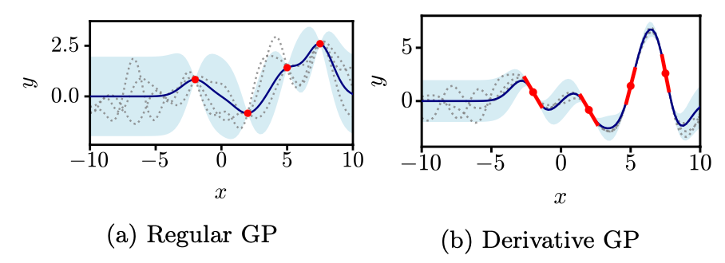
   </a>

.center.bold.huge[Bring AI/ML deep into our analysis tooling]
]
]

---
# Analysis Reuse: Maximizing scientific value

.kol-1-2[
.huge[
* Data and analyses done at the LHC are .bold[scientific opportunities performed under unique experimental conditions]
* Statistical models uses for experimental physics results are .bold[essential information] for analysis preservation and reuse
* .bold[Publish them] (on )!
]
]
.kol-1-2[
  

   <a href="https://inspirehep.net/literature/1919763">
      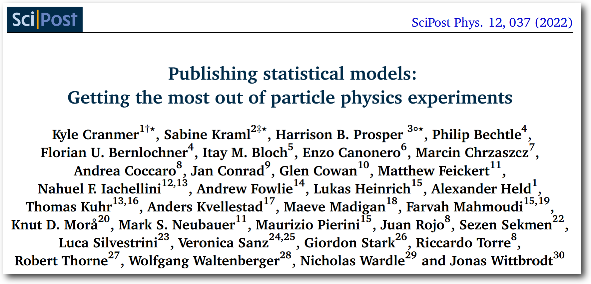
   </a>

]

---
# Full statistical model publication...

 
.center[...making good on [19 year old agreement to publish likelihoods](https://indico.cern.ch/event/746178/contributions/3396797/)]

   <a href="https://cds.cern.ch/record/411537">
      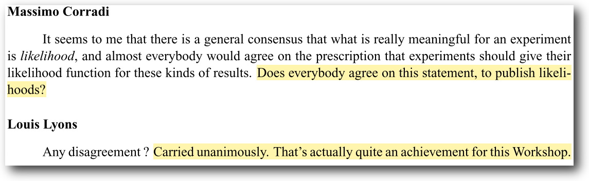
   </a>
.center[([1st Workshop on Confidence Limits, CERN, 2000](http://inspirehep.net/record/534129))]

.center.huge.bold[This hadn't been done in HEP until `pyhf` in 2019]

<!-- .bold[This hadn't been done in HEP until `pyhf` in 2019]
- A "open world" of statistical models gives a difficult domain problem to solve
- What to preserve and how? All of the ROOT `C++` framework and binary model files?
- Idea: Focus on a single more tractable binned model first -->

---
# ATLAS validation and publication of full models

.kol-1-2[
.center.width-100[[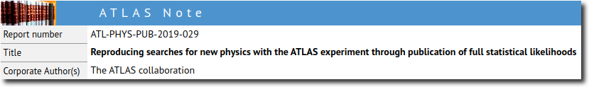](https://cds.cern.ch/record/2684863)]

.center.width-90[[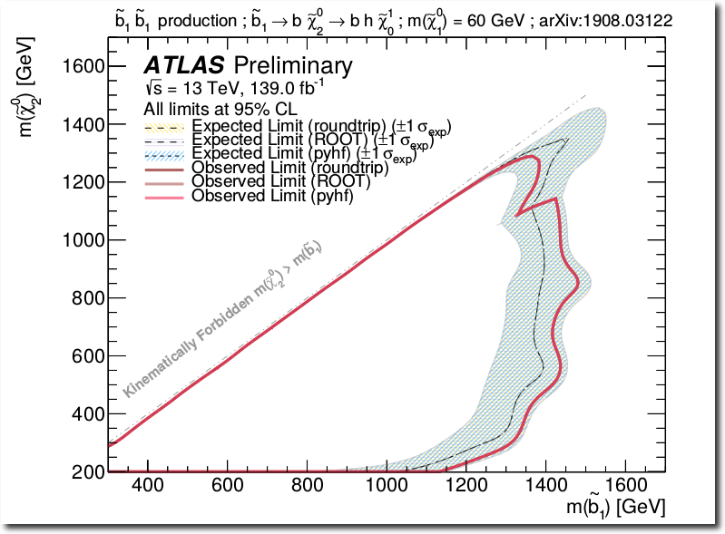](https://cds.cern.ch/record/2684863)]

 
.center[(ATLAS, 2019)]
]
.kol-1-2[
.center.width-100[[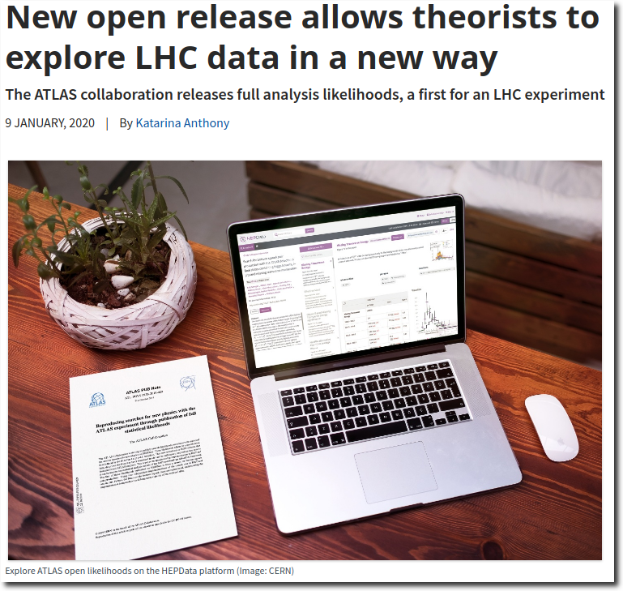](https://home.cern/news/news/knowledge-sharing/new-open-release-allows-theorists-explore-lhc-data-new-way)]
.center[(CERN News and Homepage, 2020)]
]

---
# Analysis Reuse: Reinterpretation with RECAST

.large[
* Reinterpret existing experimental result in the context of an alternative physics signal hypothesis
]

.kol-1-1[
.kol-1-3[

   <a href="https://atlas.web.cern.ch/Atlas/GROUPS/PHYSICS/PUBNOTES/ATL-PHYS-PUB-2020-007/">
      <!-- 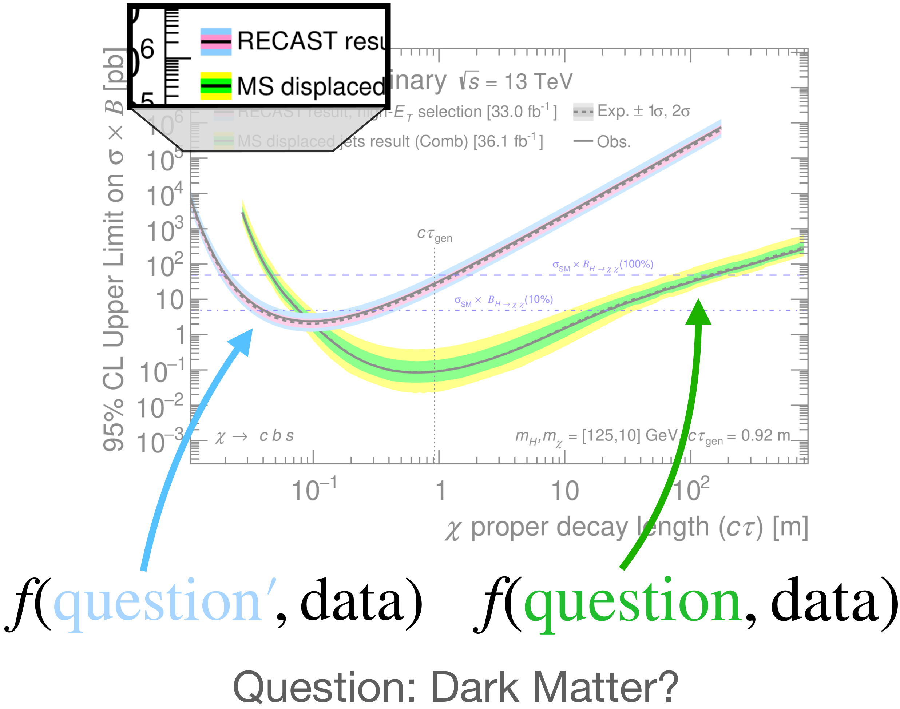 -->
      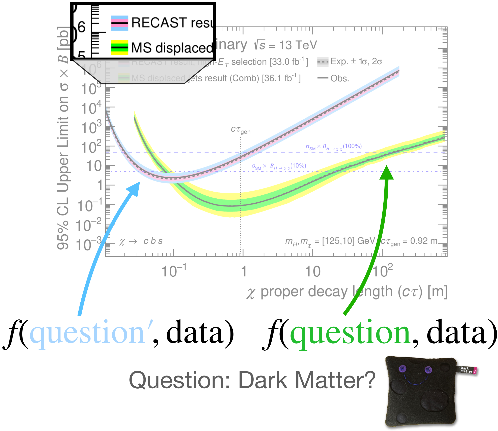
   </a>

]
.kol-2-3[

   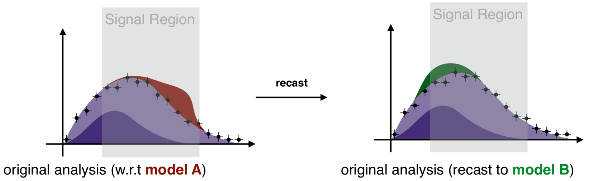

]
]

.large[
* Workflow language based [RECAST](https://github.com/recast-hep/recast-atlas) .bold[reinterpretation and analysis preservation] framework (Cranmer, Heinrich, Feickert) has been implemented in ATLAS as an enabling technology
* Results leading to ATLAS public notes extending the physics reach of original publications
]

---
# Analysis Reuse enabling new physics analysis

.kol-1-3[
* RECAST is designed to work with the CERN  open source reproducible research data analysis platform to .bold[perform analysis at scale]
* RECAST + REANA enabled the recent (2024) ATLAS LHC Run-2 Phenomenological Minimal Supersymmetric Standard Model (pMSSM) scan [analysis](https://atlas.web.cern.ch/Atlas/GROUPS/PHYSICS/PAPERS/SUSY-2020-15/)
   - Addresses a 19-dimensional parameter sub-space of the theory
   - Analysis of combination of published ATLAS LHC Run-2 analyses uses .bold[tens of thousands] of parameter space models, resulting in .bold[many hundreds of full analysis evaluations]
]
.kol-2-3[

   <a href="https://atlas.web.cern.ch/Atlas/GROUPS/PHYSICS/PAPERS/SUSY-2020-15/">
      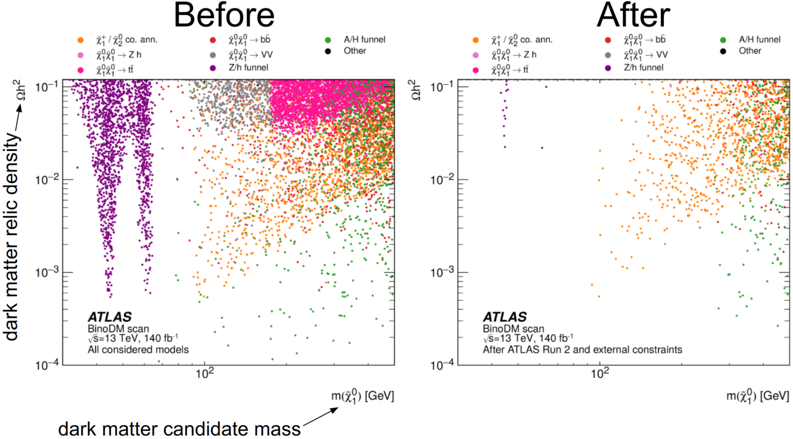
   </a>

.center.large[Analysis .bold[nearly excluded all models] in $Z/h$ "funnel region" (where a low-mass neutralino would not oversaturate the dark matter relic abundance)]
]

---
# Analysis Reuse enabling new physics analysis

.kol-1-2[
.huge[
   
Analysis .bold[would be intractable] without existing full analysis preservation from RECAST scaled to thousands of cores with REANA
]
]
.kol-1-2[

   <a href="https://ep-news.web.cern.ch/content/extending-atlas-physics-reach-analysis-reuse-technology">
      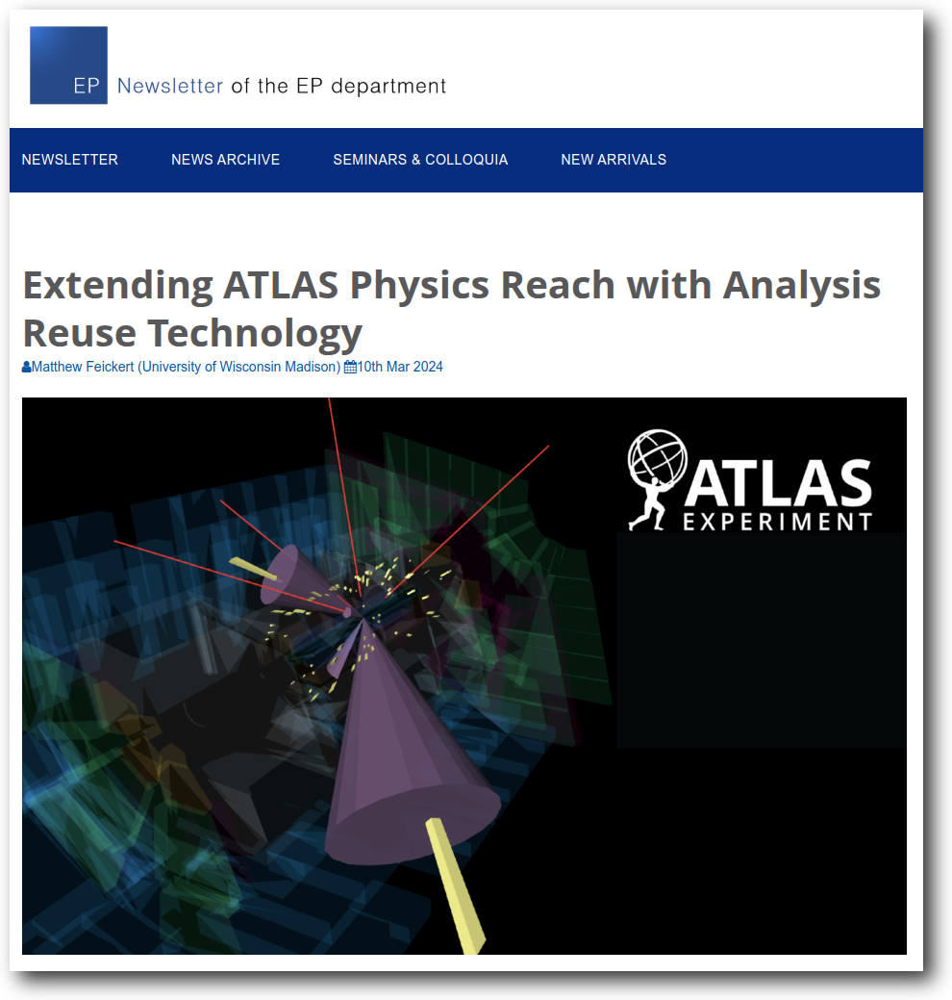
   </a>
.caption[CERN Experimental Physics Department newsletter March 2024]

]

---
# Scaling is reasonable

<!-- From the 2023 MIAPbP Workshop on on Differentiable and Probabilistic Programming for physics engagement with the broader community showed multiple large scale workflows -->

.center.huge[.bold[If] things are differentiable, shouldn't be scared of .bold[large-scale codebases and applications]]

.kol-1-2[

   <a href="https://www.munich-iapbp.de/probabilistic-programming/">
      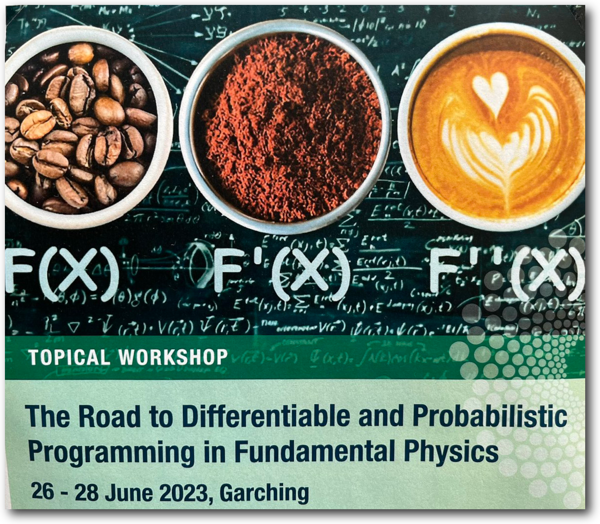
   </a>

]
.kol-1-2[

   <a href="https://indico.ph.tum.de/event/7314/contributions/7432/">
      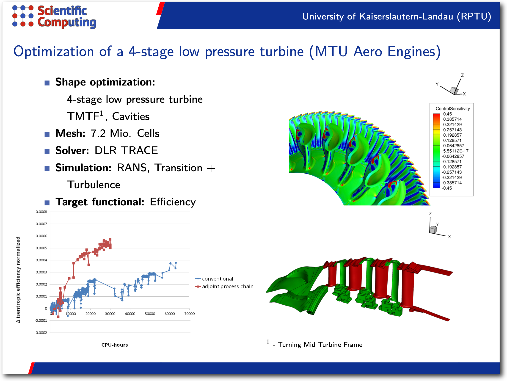
   </a>

.center[[Nicolas Gauger, MIAPbP Workshop 2023](https://indico.ph.tum.de/event/7314/contributions/7432/)]
]

---
# Analysis Reuse leverging global resoruces

.kol-1-2[
* Use of CERN REANA instance has been a success for ATLAS physics anlayses and starting to see an uptick in use by CMS
* Realistically, CERN is the only current viable deployment of REANA &mdash; huge limitation in use!
   - Have been discussing with Eric Lancon on ways to improve the BNL deployment
* Exploring REANA at CHTC with advice from UW-Madison CHTC/IRIS-HEP/OSG colleague [.bold[Brian Lin]](https://chtc.cs.wisc.edu/people.html)
* CHTC has world experts in technologies used for REANA
* Enable more kinds of physics anlaysis at scale, and leverage CHTC for .bold[active learning] workflows
]
.kol-1-2[
<!-- 

   

 -->

   <a href="https://indico.cern.ch/event/708041/contributions/3269754/">
      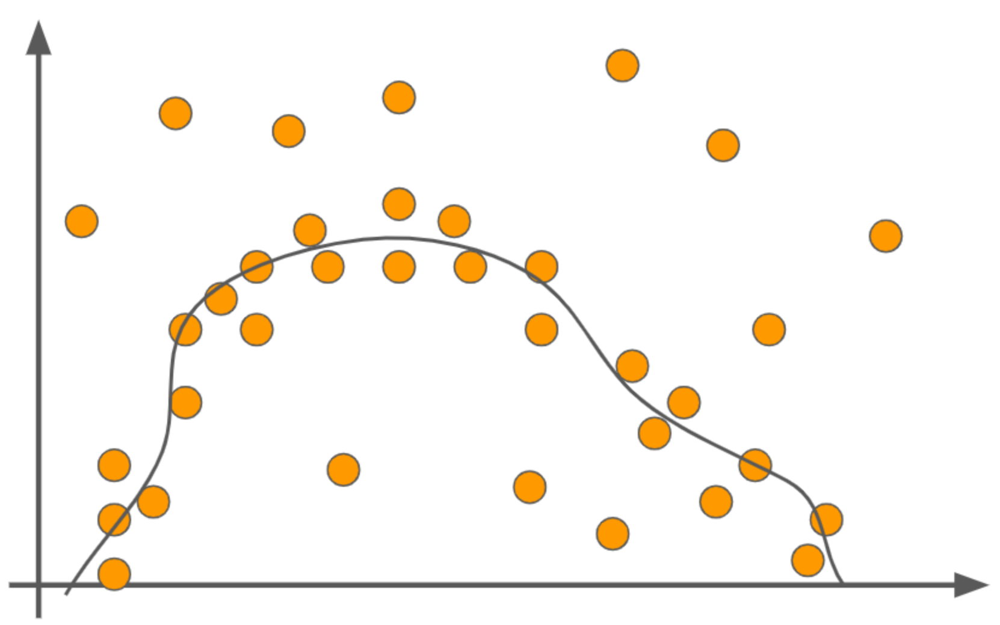
   </a>

.caption[[ATL-PHYS-PUB-2023-010](https://atlas.web.cern.ch/Atlas/GROUPS/PHYSICS/PUBNOTES/ATL-PHYS-PUB-2023-010/)]

.center[Iterative procedure to actively collect new labelled data for an optimisation task]
]

---
# Ongoing and future work

.large[
* Automatic differentiation is a rich field of research unto itself
   - [Machine-learning Optimized Design of Experiments (MODE) collaboration](https://mode-collaboration.github.io/) working towards detector design .bold[optimization using automatic differentiation]
   - Differentiable programming can .bold[attack problems across fields]
* Applications of Neural Simulation Based Inference (NSBI) to analysis at LHC
   - Ongoing work with UW-Madison ATLAS group with .bold[postdoc Jay Sandesara] (lead first ATLAS NSBI analysis)
   - .bold[Devleoping NSBI tooling] inside of IRIS-HEP Analysis Systems, building off of UW-Madison team's experience with MadMiner
   - Applications of NSBI to Standard Model Effective Field Theories in ATLAS for .bold[flasgship LHC EFT measurements]
<!-- * Expanding scope of RECAST -->
* Expanding use of REANA to new physics analyses
   - .bold[Expanding applications in BSM analyses] inside of ATLAS
   - Applications of REANA to .bold[physics beyond HEP]
]
<!-- 

   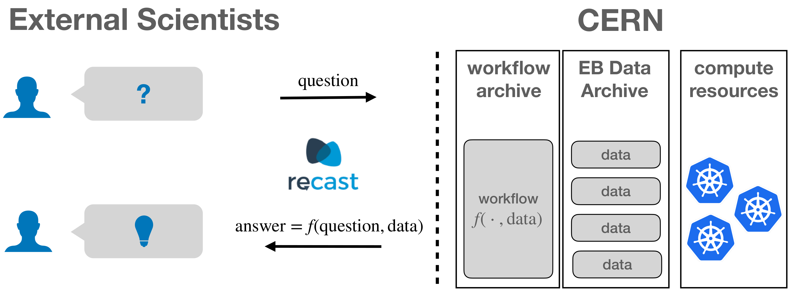

 -->

---
# Summary

.large[
* Many challenges and opportunities ahead at the HL-LHC
<!-- * Engaging the broader scientific open source community has been a boon for particle physics tooling -->
* IRIS-HEP building .bold[analysis tools for the HL-LHC] and beyond
* Automatic differentiation gives .bold[powerful AI/ML tool with differentiable programming]
* .bold[Scalable and reusable analysis workflows] allow leveraging our tools for new physics
* .bold[Exciting future] with investment in these research areas happening now!
]

.kol-1-3[

   

]
.kol-1-3[

   

]
.kol-1-3[

   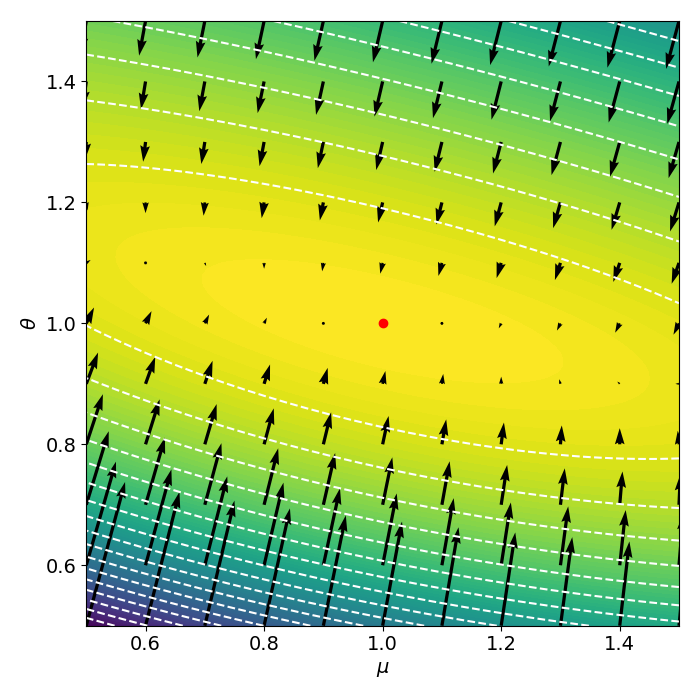

]

---
class: end-slide, center

.large[Backup]

---
# Opportunities and Challenges of the HL-LHC

.center.large[Challenge to be able to .bold[record, store, and analyze] the data]

.kol-1-2[

   <a href="https://cds.cern.ch/record/2802918">
      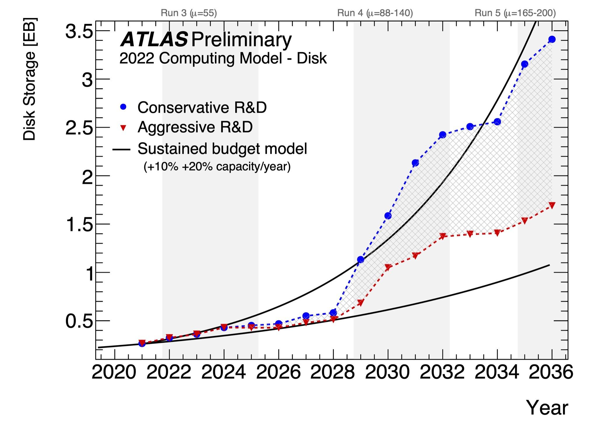
   </a>

]
.kol-1-2[
 

   <a href="https://cds.cern.ch/record/2815292?ln=en">
      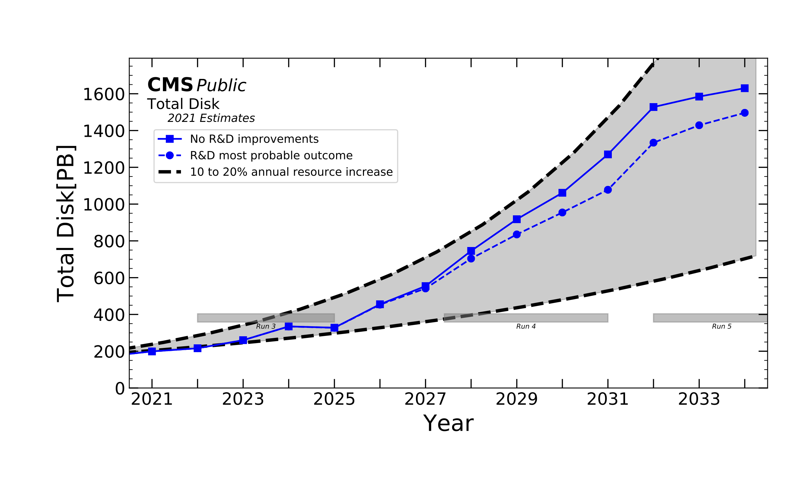
   </a>

]

.center.large[Projected .bold[required disk usage] for HL-LHC (want R&D below budget line)]

.center[[ATLAS](https://cds.cern.ch/record/2803119?ln=en) and [CMS](https://cds.cern.ch/record/2815292?ln=en) software and computing reviews]

---
# Anlaysis Systems Tool Overview

   <a href="https://iris-hep.org/as.html">
      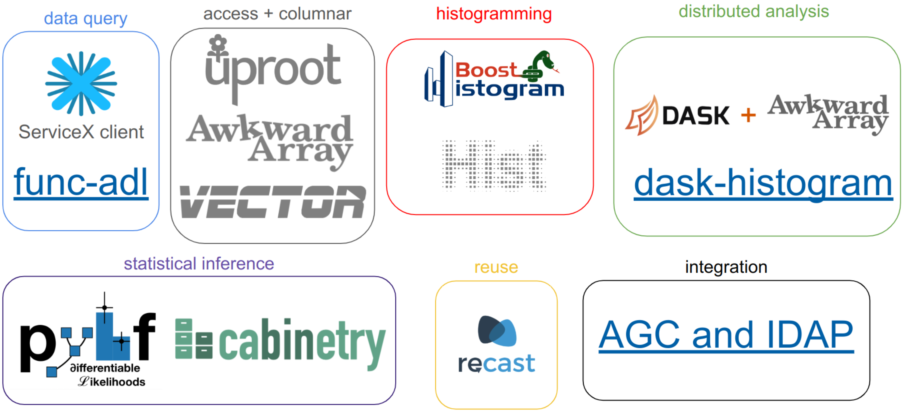
   </a>

---
# Rapid rise of Python for analysis in HEP

   <a href="https://matthewfeickert.github.io/talk-doepy-python-exchange-2022/2022-06-29.pdf">
      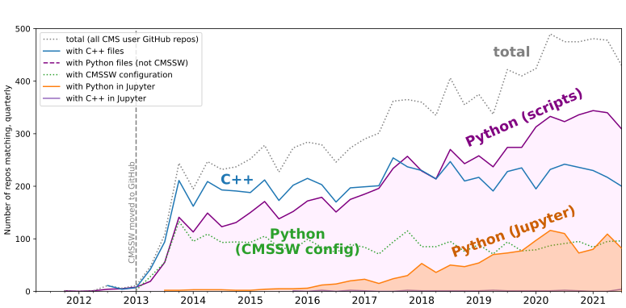
   </a>

.center.large["import XYZ" matches in GitHub repos for users who fork [CMSSW](https://github.com/cms-sw/cmssw) by file]

.footnote[[Modern Python analysis ecosystem for High Energy Physics](https://matthewfeickert.github.io/talk-doepy-python-exchange-2022/2022-06-29.pdf), Jim Pivarski, Matthew Feickert, Gordon Watts]

---
# Explosion of Scientific Python (NumPy, etc.)

   <a href="https://matthewfeickert.github.io/talk-doepy-python-exchange-2022/2022-06-29.pdf">
      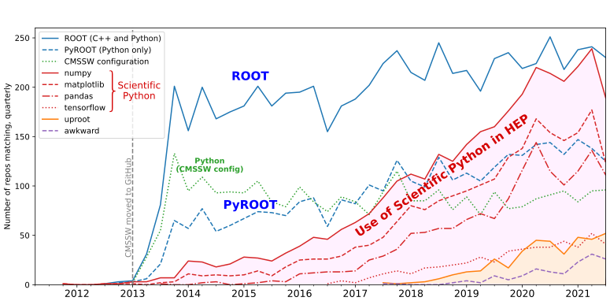
   </a>

.center.large["import XYZ" matches in GitHub repos for users who fork [CMSSW](https://github.com/cms-sw/cmssw) by library/tool]

.footnote[[Modern Python analysis ecosystem for High Energy Physics](https://matthewfeickert.github.io/talk-doepy-python-exchange-2022/2022-06-29.pdf), Jim Pivarski, Matthew Feickert, Gordon Watts]

---
# Ecosystems

   <a href="https://coiled.io/blog/pydata-dask/">
      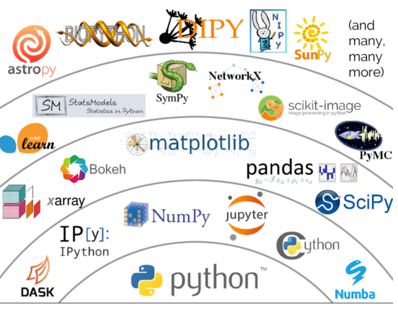
   </a>

.center.large[
In his [PyCon 2017 keynote](https://youtu.be/ZyjCqQEUa8o), Jake VanderPlas gave us the iconic "PyData ecosystem" image 
(now known as "Scientific Python")
]

---
# PyHEP ecosystem

   <a href="https://indico.cern.ch/event/1140031/">
      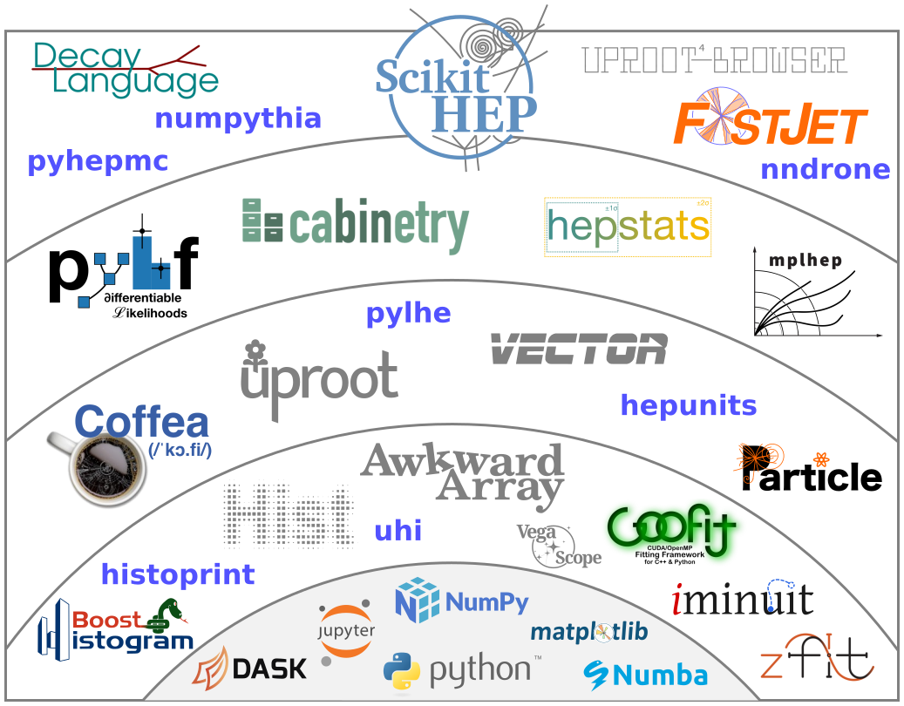
   </a>

.center.large[
In [2022](https://indico.cern.ch/event/1140031/) created a view for the PyHEP ecosystem
]

---
# Scaling and Analysis Reuse

   

.center[Revisiting .bold[IRIS-HEP Analysis Systems] in the context of distributed scaling (HL-LHC) and analysis reuse]

---
# Automatic Differentiation: Forward and Reverse

.center[Performing maps $f: \mathbb{R}^{m} \to \mathbb{R}^{n}$]
 
.center[aka, "wide" vs. "tall" transformations]
 
.kol-1-2[
- .bold[Forward] mode
- Column wise evaluation of Jacobian
   - Jacobian-vector products
   - Execution time scales with input parameters
   - Example: few variables into very high dimensional spaces $\mathbb{R} \to \mathbb{R}^{100}$
]
.kol-1-2[
- .bold[Reverse] mode
- Row wise evaluation of Jacobian
   - vector-Jacobian products
   - Execution time scales with output parameters
   - Example: scalar maps from very high-dimensional spaces $\mathbb{R}^{100} \to \mathbb{R}$
]

 
.center[Allows for efficient computation depending on dimensionality]

---
# HistFactory Model

- A flexible probability density function (p.d.f.) template to build statistical models in high energy physics
- Developed in 2011 during work that lead to the Higgs discovery [[CERN-OPEN-2012-016](http://inspirehep.net/record/1236448)]
- Widely used by ATLAS for .bold[measurements of known physics] (Standard Model) and .bold[searches for new physics] (beyond the Standard Model)

.kol-2-5.center[
.width-90[[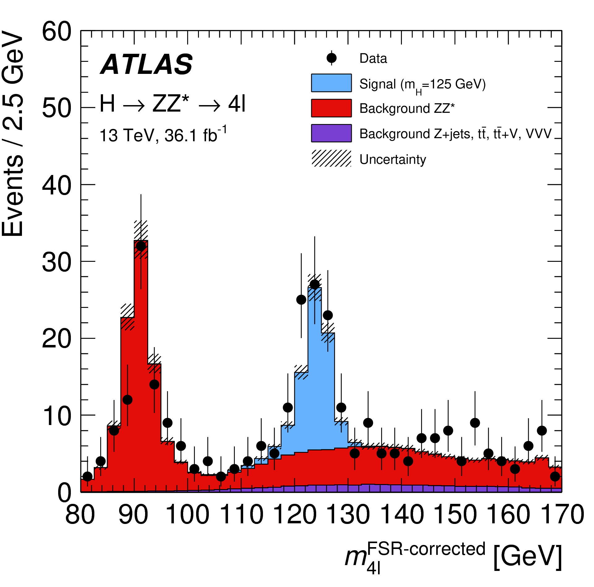](https://atlas.web.cern.ch/Atlas/GROUPS/PHYSICS/PAPERS/HIGG-2016-25/)]
.bold[Standard Model]
]
.kol-3-5.center[
.width-100[[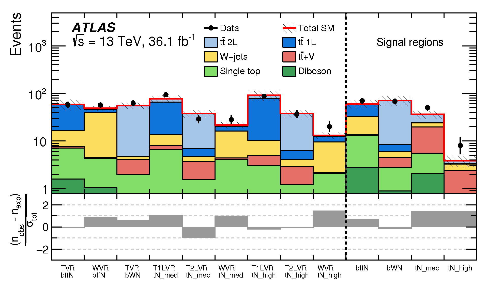](https://atlas.web.cern.ch/Atlas/GROUPS/PHYSICS/PAPERS/SUSY-2016-16/)]
.bold[Beyond the Standard Model]
]

---
# HistFactory Template: at a glance

<!-- \definecolor{data}{HTML}{00a620}
\definecolor{auxdata}{HTML}{a3130f}
\definecolor{freepars}{HTML}{0495fc}
\definecolor{conpars}{HTML}{9c2cfc} -->
$$
f\left(\mathrm{data}\middle|\mathrm{parameters}\right) =  f\left(\textcolor{#00a620}{\vec{n}}, \textcolor{#a3130f}{\vec{a}}\middle|\textcolor{#0495fc}{\vec{\eta}}, \textcolor{#9c2cfc}{\vec{\chi}}\right) = \textcolor{blue}{\prod\_{c \\,\in\\, \textrm{channels}} \prod\_{b \\,\in\\, \textrm{bins}\_c} \textrm{Pois} \left(n\_{cb} \middle| \nu\_{cb}\left(\vec{\eta}, \vec{\chi}\right)\right)} \\,\textcolor{red}{\prod\_{\chi \\,\in\\, \vec{\chi}} c\_{\chi} \left(a\_{\chi}\middle|\chi\right)}
$$

.center[$\textcolor{#00a620}{\vec{n}}$: .obsdata[events], $\textcolor{#a3130f}{\vec{a}}$: .auxdata[auxiliary data], $\textcolor{#0495fc}{\vec{\eta}}$: .freepars[unconstrained pars], $\textcolor{#9c2cfc}{\vec{\chi}}$: .conpars[constrained pars]]

$$
\nu\_{cb}(\textcolor{#0495fc}{\vec{\eta}}, \textcolor{#9c2cfc}{\vec{\chi}}) = \sum\_{s \\,\in\\, \textrm{samples}} \underbrace{\left(\sum\_{\kappa \\,\in\\, \vec{\kappa}} \kappa\_{scb}(\textcolor{#0495fc}{\vec{\eta}}, \textcolor{#9c2cfc}{\vec{\chi}})\right)}\_{\textrm{multiplicative}} \Bigg(\nu\_{scb}^{0}(\textcolor{#0495fc}{\vec{\eta}}, \textcolor{#9c2cfc}{\vec{\chi}}) + \underbrace{\sum\_{\Delta \\,\in\\, \vec{\Delta}} \Delta\_{scb}(\textcolor{#0495fc}{\vec{\eta}}, \textcolor{#9c2cfc}{\vec{\chi}})}\_{\textrm{additive}}\Bigg)
$$

.bold[Use:] Multiple disjoint _channels_ (or regions) of binned distributions with multiple _samples_ contributing to each with additional (possibly shared) systematics between sample estimates

.bold[Main pieces:]
- .blue[Main Poisson p.d.f. for simultaneous measurement of multiple channels]
- .katex[Event rates] $\nu\_{cb}(\textcolor{#0495fc}{\vec{\eta}}, \textcolor{#9c2cfc}{\vec{\chi}})$ (nominal rate $\nu\_{scb}^{0}$ with rate modifiers)
   - encode systematic uncertainties (e.g. normalization, shape)
- .red[Constraint p.d.f. (+ data) for "auxiliary measurements"]

---
# HistFactory Template: at a second glance

<!-- \definecolor{data}{HTML}{00a620}
\definecolor{auxdata}{HTML}{a3130f}
\definecolor{freepars}{HTML}{0495fc}
\definecolor{conpars}{HTML}{9c2cfc} -->
$$
f\left(\mathrm{data}\middle|\mathrm{parameters}\right) =  f\left(\textcolor{#00a620}{\vec{n}}, \textcolor{#a3130f}{\vec{a}}\middle|\textcolor{#0495fc}{\vec{\eta}}, \textcolor{#9c2cfc}{\vec{\chi}}\right) = \prod\_{c \\,\in\\, \textrm{channels}} \prod\_{b \\,\in\\, \textrm{bins}\_c} \textrm{Pois} \left(\textcolor{#00a620}{n\_{cb}} \middle| \nu\_{cb}\left(\textcolor{#0495fc}{\vec{\eta}}, \textcolor{#9c2cfc}{\vec{\chi}}\right)\right) \\,\prod\_{\chi \\,\in\\, \vec{\chi}} c\_{\chi} \left(\textcolor{#a3130f}{a\_{\chi}}\middle|\textcolor{#9c2cfc}{\chi}\right)
$$

.center[$\textcolor{#00a620}{\vec{n}}$: .obsdata[events], $\textcolor{#a3130f}{\vec{a}}$: .auxdata[auxiliary data], $\textcolor{#0495fc}{\vec{\eta}}$: .freepars[unconstrained pars], $\textcolor{#9c2cfc}{\vec{\chi}}$: .conpars[constrained pars]]

$$
\nu\_{cb}(\textcolor{#0495fc}{\vec{\eta}}, \textcolor{#9c2cfc}{\vec{\chi}}) = \sum\_{s \\,\in\\, \textrm{samples}} \underbrace{\left(\sum\_{\kappa \\,\in\\, \vec{\kappa}} \kappa\_{scb}(\textcolor{#0495fc}{\vec{\eta}}, \textcolor{#9c2cfc}{\vec{\chi}})\right)}\_{\textrm{multiplicative}} \Bigg(\nu\_{scb}^{0}(\textcolor{#0495fc}{\vec{\eta}}, \textcolor{#9c2cfc}{\vec{\chi}}) + \underbrace{\sum\_{\Delta \\,\in\\, \vec{\Delta}} \Delta\_{scb}(\textcolor{#0495fc}{\vec{\eta}}, \textcolor{#9c2cfc}{\vec{\chi}})}\_{\textrm{additive}}\Bigg)
$$

.bold[Use:] Multiple disjoint _channels_ (or regions) of binned distributions with multiple _samples_ contributing to each with additional (possibly shared) systematics between sample estimates

.bold[Main pieces:]
- .blue[Main Poisson p.d.f. for simultaneous measurement of multiple channels]
- .katex[Event rates] $\nu\_{cb}(\textcolor{#0495fc}{\vec{\eta}}, \textcolor{#9c2cfc}{\vec{\chi}})$ (nominal rate $\nu\_{scb}^{0}$ with rate modifiers)
   - encode systematic uncertainties (e.g. normalization, shape)
- .red[Constraint p.d.f. (+ data) for "auxiliary measurements"]

---
# HistFactory Template: grammar

$$
f\left(\mathrm{data}\middle|\mathrm{parameters}\right) =  f\left(\textcolor{#00a620}{\vec{n}}, \textcolor{#a3130f}{\vec{a}}\middle|\textcolor{#0495fc}{\vec{\eta}}, \textcolor{#9c2cfc}{\vec{\chi}}\right) = \color{blue}{\prod\_{c \\,\in\\, \textrm{channels}} \prod\_{b \\,\in\\, \textrm{bins}\_c} \textrm{Pois} \left(n\_{cb} \middle| \nu\_{cb}\left(\vec{\eta}, \vec{\chi}\right)\right)} \\,\color{red}{\prod\_{\chi \\,\in\\, \vec{\chi}} c\_{\chi} \left(a\_{\chi}\middle|\chi\right)}
$$

Mathematical grammar for a simultaneous fit with multiple disjoint _channels_ (or regions) of binned distributions with multiple _samples_ contributing to each with additional (possibly shared) systematics between sample estimates

.kol-1-2[
.bold[Main pieces:]
- .blue[Main Poisson p.d.f. for simultaneous measurement of multiple channels]
- .katex[Event rates] $\nu\_{cb}(\textcolor{#0495fc}{\vec{\eta}}, \textcolor{#9c2cfc}{\vec{\chi}})$ (nominal rate $\nu\_{scb}^{0}$ with rate modifiers)
- .red[Constraint p.d.f. (+ data) for "auxiliary measurements"]
   - encode systematic uncertainties (e.g. normalization, shape)
<!-- - $\vec{n}$: events, $\vec{a}$: auxiliary data, $\vec{\eta}$: unconstrained pars, $\vec{\chi}$: constrained pars -->
- $\textcolor{#00a620}{\vec{n}}$: .obsdata[events], $\textcolor{#a3130f}{\vec{a}}$: .auxdata[auxiliary data], $\textcolor{#0495fc}{\vec{\eta}}$: .freepars[unconstrained pars], $\textcolor{#9c2cfc}{\vec{\chi}}$: .conpars[constrained pars]
]
.kol-1-2[
.center.width-100[]
.center[Example: .bold[Each bin] is separate (1-bin) _channel_,  each .bold[histogram] (color) is a _sample_ and share  a .bold[normalization systematic] uncertainty]
]

---
# HistFactory Template: systematic uncertainties

.kol-4-7[
- In HEP common for systematic uncertainties to be specified with two template histograms: "up" and "down" variation for parameter $\theta \in \\{\textcolor{#0495fc}{\vec{\eta}}, \textcolor{#9c2cfc}{\vec{\chi}} \\}$
   - "up" variation: model prediction for $\theta = +1$
   - "down" variation: model prediction for $\theta = -1$
   - Interpolation and extrapolation choices provide .bold[model predictions $\nu(\vec{\theta}\,)$ for any $\vec{\theta}$]
<!--  -->
- [Constraint terms](https://pyhf.readthedocs.io/en/v0.6.3/intro.html#id25) $c\_{j} \left(\textcolor{#a3130f}{a\_{j}}\middle|\textcolor{#9c2cfc}{\theta_{j}}\right)$ used to model auxiliary measurements. Example for Normal (most common case):
   - Mean of nuisance parameter $\textcolor{#9c2cfc}{\theta_{j}}$ with normalized width ($\sigma=1$)
   - Normal: auxiliary data $\textcolor{#a3130f}{a\_{j} = 0}$ (aux data function of modifier type)
   - Constraint term produces penalty in likelihood for pulling $\textcolor{#9c2cfc}{\theta_{j}}$ away from auxiliary measurement value
   - As $\nu(\vec{\theta}\,)$ constraint terms inform rate modifiers (.bold[systematic uncertainties]) during simultaneous fit
   - Example: Correlated shape `histosys` modifier could represent part of the uncertainty associated with a jet energy scale
]
.kol-3-7[
.center.width-70[[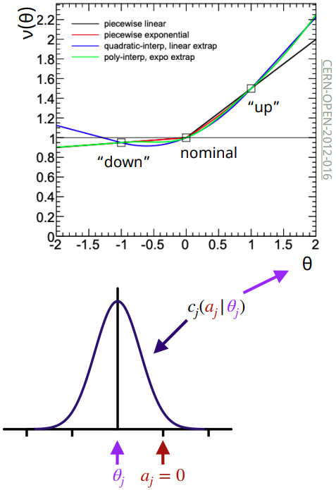](https://indico.cern.ch/event/1076231/contributions/4560405/)]
.center[Image credit: [Alex Held](https://indico.cern.ch/event/1076231/contributions/4560405/)]
]

---
# Moving towards differentiable workflows

.kol-1-3[

   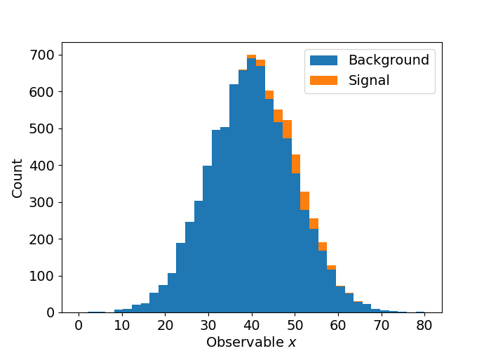

* Counting experiment for presence of signal process
* Place discriminate selection ("cut") on observable $x$ to maximize significance $S(x)$
* Step along cut values in $x$ and calculate significance
]
.kol-1-3[

   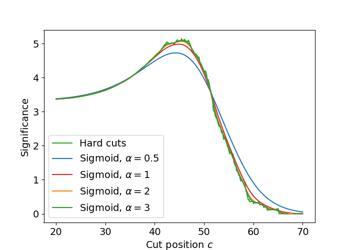

* Need differentiable analogue to non-differentiable cut
* Weight events using activation function of sigmoid

.center[$w=\left(1 + e^{-\alpha(x-c)}\right)^{-1}$]

* Event far .italic[below] cut: $w \to 0$
* Event far .italic[above] cut: $w \to 1$
]
.kol-1-3[

   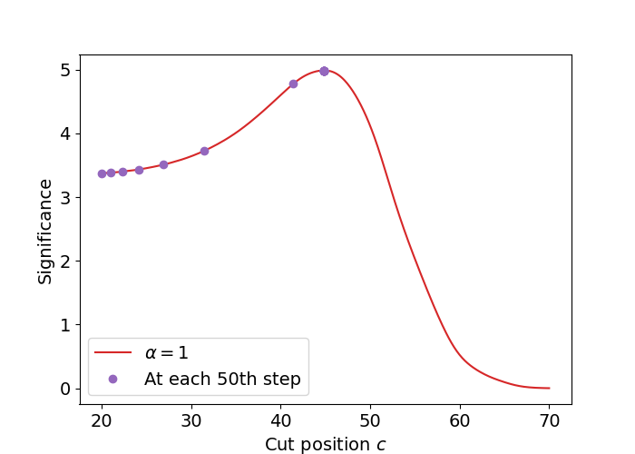

* With a simple gradient descent algorithm can easily automate the significance optimization
* Allows for the "cut" to become a parameter that can be differentiated through for the larger analysis
]

---
# HEP Example: Likelihood Gradients

.kol-1-2.center[

   <a href="https://indico.cern.ch/event/882824/timetable/#45-introduction-to-automatic-d">
      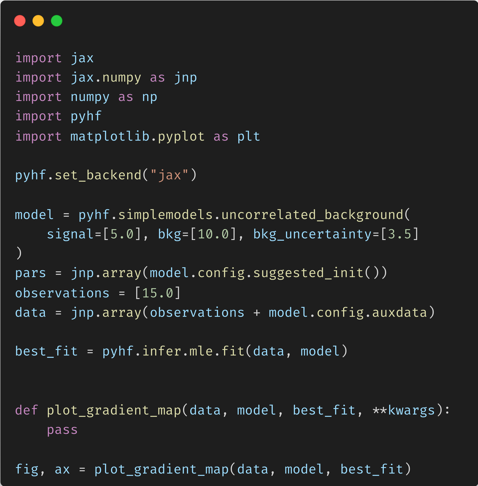
   </a>

]
.kol-1-2.center[

   

]

.bold.center.large[Having access to the gradients can make the fit orders of magnitude faster than finite difference]

---
# Discriminate Signal and Background
<!--  -->
* Counting experiment for presence of signal process
* Place discriminate selection cut on observable $x$ to maximize significance
   - Significance: $\sqrt{2 (S+B) \log(1 + \frac{S}{B})-2S}$ (for small $S/B$: significance $\to S/\sqrt{B}$)

.footnote[Example inspired by Alexander Held's [example of a differentiable analysis](https://github.com/alexander-held/differentiable-analysis-example/)]

.kol-1-2.center[

   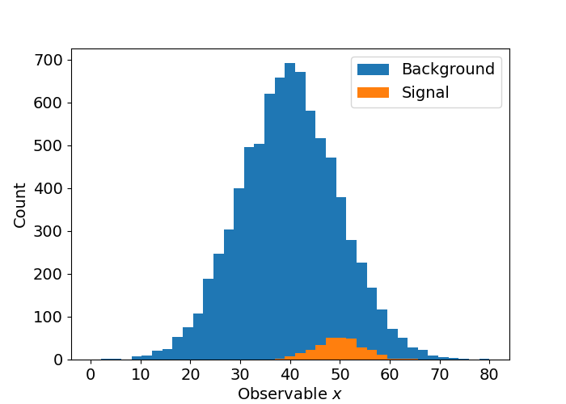

]
.kol-1-2.center[

   

]

---
# Traditionally: Scan across cut values
<!--  -->
- Set baseline cut at $x=0$ (accept everything)
- Step along cut values in $x$ and calculate significance at each cut. Keep maximum.
<!--  -->
.kol-1-2.center[
.width-100[]
]
.kol-1-2[
.width-100[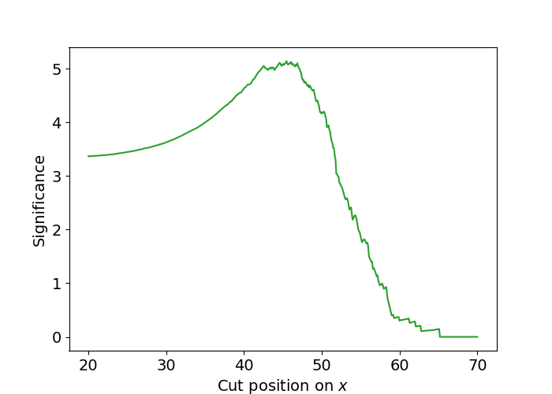]
]

.center[Significance: $\sqrt{2 (S+B) \log(1 + \frac{S}{B})-2S}$]

---
# Differentiable Approach

.kol-1-2.large[
- Need differentiable analogue to non-differentiable cut
- Weight events using activation function of sigmoid

.center[$w=\left(1 + e^{-\alpha(x-c)}\right)^{-1}$]

- Event far .italic[below] cut: $w \to 0$
- Event far .italic[above] cut: $w \to 1$
- $\alpha$ tunable parameter for steepness
   - Larger $\alpha$ more cut-like
]
.kol-1-2[
 
.width-100[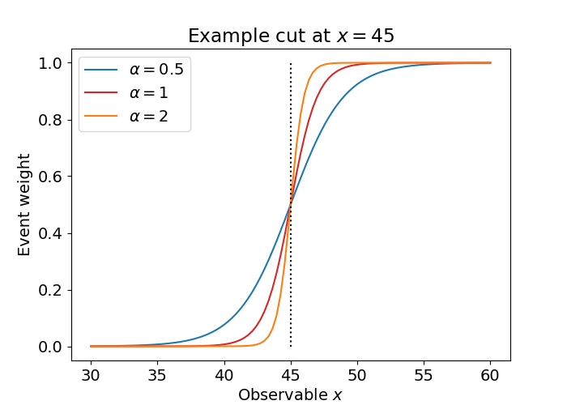]
]

---
# Compare Hard Cuts vs. Differentiable

.kol-1-2.large[
- For hard cuts the significance was calculated by applying the cut and than using the remaining $S$ and $B$ events
- But for the differentiable model there aren't cuts, so approximate cuts with the sigmoid approach and weights
- Comparing the two methods shows good agreement
- Can see that the approximation to the hard cuts improves with larger $\alpha$
   - But can become unstable, so tunable
]
.kol-1-2.center[
 
.width-100[]
]

---
# Compare Hard Cuts vs. Differentiable

.kol-1-2.large[
- For hard cuts the significance was calculated by applying the cut and then using the remaining $S$ and $B$ events
- But for the differentiable model there aren't cuts, so approximate cuts with the sigmoid approach and weights
- Comparing the two methods shows good agreement
- Can see that the approximation to the hard cuts improves with larger $\alpha$
   - But can become unstable, so tunable
]
.kol-1-2.center[
 
.width-100[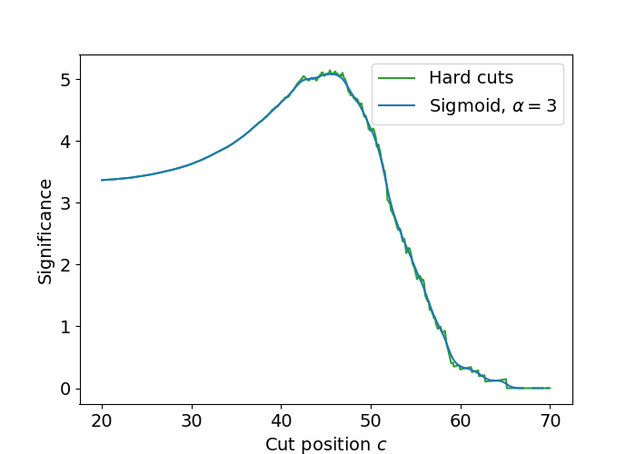]
]

---
# Accessing the Gradient

.kol-2-5.large[
* Most importantly though, with the differentiable model we have access to the gradient
   - $\partial_{x} f(x)$
* So can find the maximum significance at the point where the gradient of the significance is zero
   - $\partial_{x} f(x) = 0$
* With the gradient in hand this cries out for automated optimization!
]
.kol-3-5.center[

   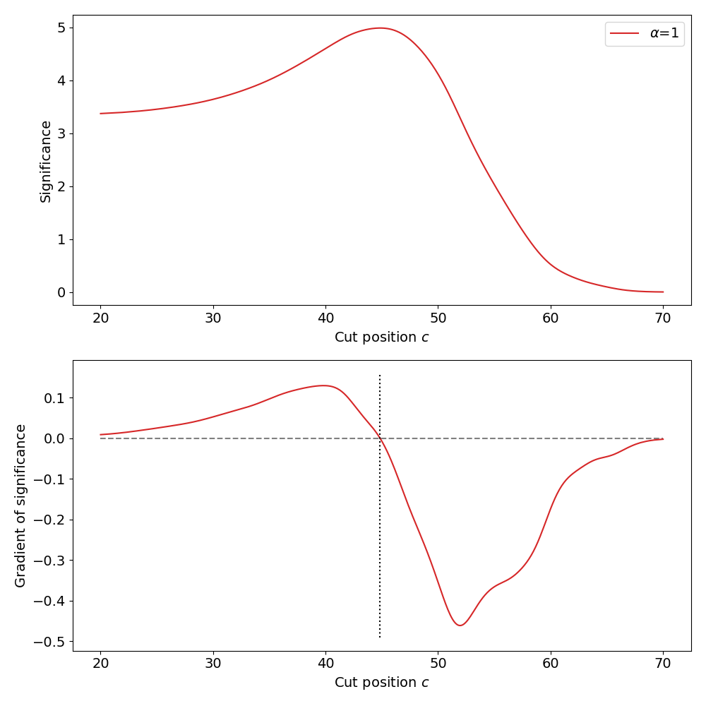

]

---
# Automated Optimization

.kol-2-5.large[
* With a simple gradient descent algorithm can easily automate the significance optimization
* For this toy example, obviously less efficient then cut and count scan
* Gradient methods apply well in higher dimensional problems
* Allows for the "cut" to become a parameter that can be differentiated through for the larger analysis
]
.kol-3-5.center[
.width-100[]

<!-- TODO: Make this an animated GIF -->
]

---
# What is `pyhf`?

Please checkout the many resources we have starting with the [website](https://scikit-hep.org/pyhf/) and the [SciPy 2020 talk](https://youtu.be/FrH9s3eB6fU)!

<!--  -->

.grid[
.kol-1-3.center[
.width-60[]
]
.kol-1-3.center[
 
.width-60[]
]
.kol-1-3.center[
 
.width-70[]
]
]

---
# Differentiable Ecosystem

.kol-1-3.center[
.width-100[]

[gradhep](https://hepsoftwarefoundation.org/activities/differentiablecomputing.html)
]
.kol-1-3.center[
.width-100[]

[neos](https://github.com/gradhep/neos), [INFERNO](https://inspirehep.net/literature/1677673)
]
.kol-1-3.center[
  
.width-100[[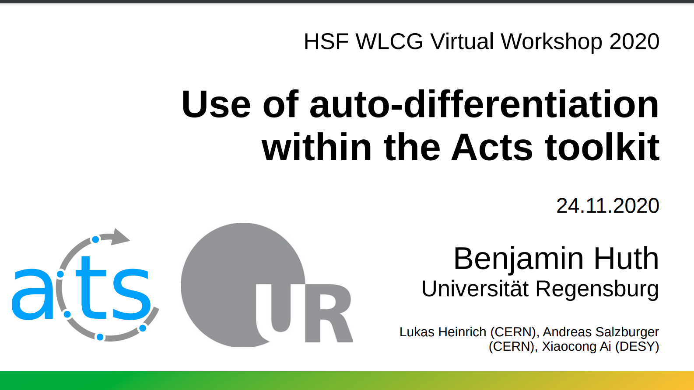](https://indico.cern.ch/event/941278/contributions/4084835/)]

   
[ACTS](https://iris-hep.org/projects/acts.html)
]

 
.kol-1-1[
.bold.center[Groups, libraries, and applications growing rapidly]
]

---
# Gradient Passing

.kol-2-5.code-large[
- Real world high energy physics analyses have various challenges:
   - Computations highly complex chains
   - Not implementable in a single framework
   - Asynchronous multi-step procedures
   - Strong need for distributed computing
- Passing of gradients .bold[between] different implementations and services
   - Large scale machine learning in industry needs to do this to train models
- Possible solution to allow for distributed computations at scale exploiting gradients
]
.kol-3-5.center[
 
.width-100[[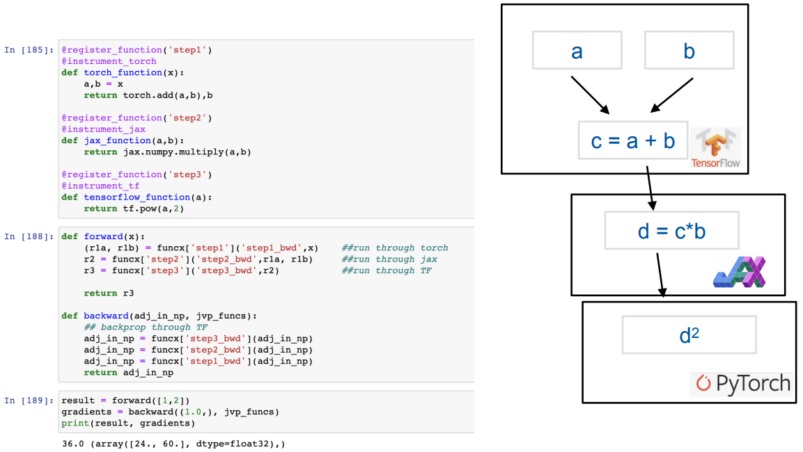](https://indico.cern.ch/event/960587/contributions/4070325/)]
.caption[[Differentiating through PyTorch, JAX, and TensorFlow using FaaS](https://indico.cern.ch/event/960587/contributions/4070325/)]
]

---
# ML + reinterpretation: Active learning

.kol-1-2[
.huge[
Leveraging [REANA](https://www.reana.io/) reproducible research data analysis platform possible to run distributed ML and analysis workflows at scale
]

   <a href="https://conference.ippp.dur.ac.uk/event/1178/contributions/6449/">
      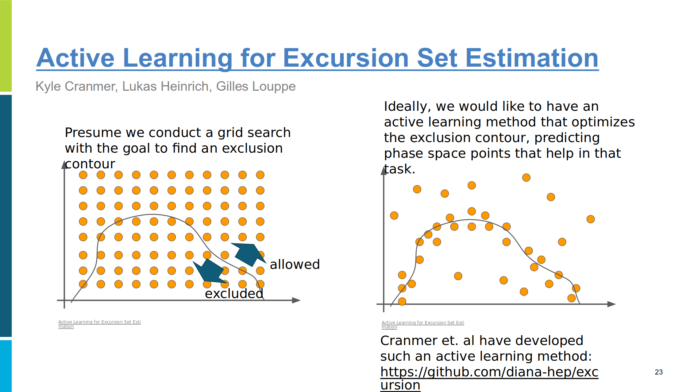
   </a>

.caption[[ Christian Weber, Reinterpretation Forum 2023](https://conference.ippp.dur.ac.uk/event/1178/contributions/6449/)]
]
.kol-1-2[

   <a href="https://conference.ippp.dur.ac.uk/event/1178/contributions/6449/">
      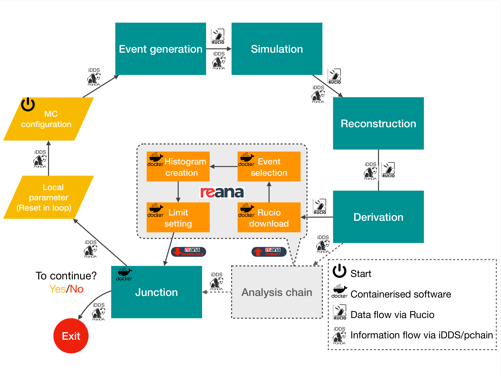
   </a>

.caption[[ATL-PHYS-PUB-2023-010](https://atlas.web.cern.ch/Atlas/GROUPS/PHYSICS/PUBNOTES/ATL-PHYS-PUB-2023-010/)]
]

---
# Active Learning

.kol-1-2.large[
* Iterative procedure to actively collect new labelled data for an optimisation task
* One or more new BSM parameter space points are selected and for each the upper limit on the BSM signal strength is evaluated
* Regression on the signal strength upper limit in the multidimensional space
* A new set of parameter space points are suggested for further analysis such that a sufficiently accurate exclusion contour may be obtained subject to some sampling budget constraints
]
.kol-1-2[

   <a href="https://indico.cern.ch/event/708041/contributions/3269754/">
      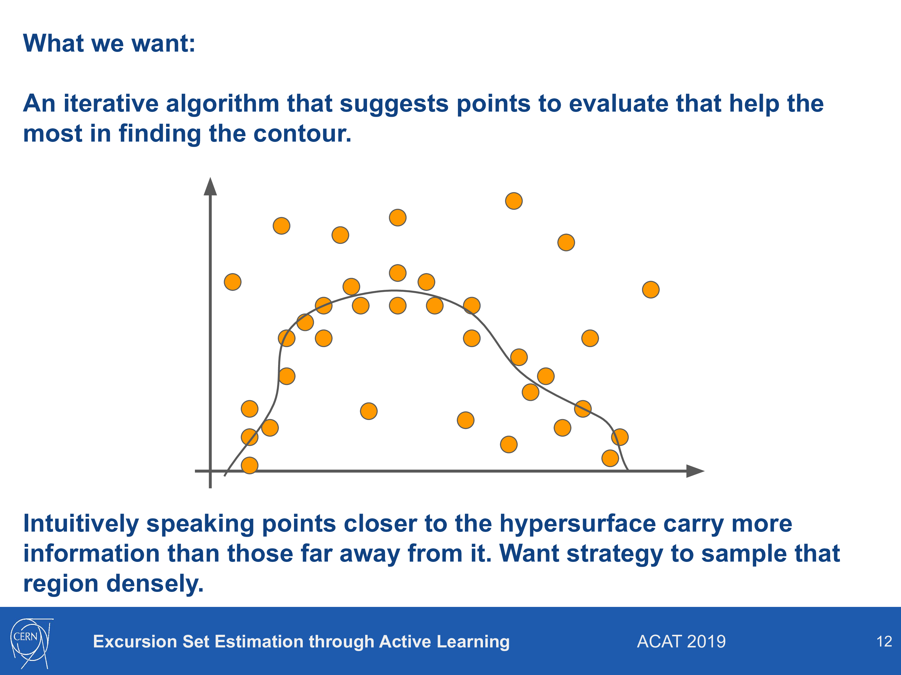
   </a>

.caption[[Active Learning for Excursion Set Estimation, ACAT 2019](https://indico.cern.ch/event/708041/contributions/3269754/)]
]

---
# Broader scientific open source collaborations

 

.kol-1-1[
.kol-1-3[

   

]
.kol-1-3[

   

]
.kol-1-3[

   

]
]
<!--  -->
.kol-1-3[
.center.huge[[dask-awkward](https://github.com/dask-contrib/dask-awkward)]

.center.larger[Native Dask collection for partioned Awkward arrays for analysis at scale]
]
.kol-1-3[
.center.huge[[scikit-build-core](https://scikit-build-core.readthedocs.io/)]

.center.larger[Next generation of build tools for scientific packaging]
]
.kol-1-3[
.center.huge[[NumFOCUS](https://numfocus.org/)]

.center.larger[Organizing and supporting scientific open source]
]

---
# Community adoption ...

   <a href="https://github.com/matthewfeickert/talk-analysis-ecosystems-workshop-2022/issues/1">
      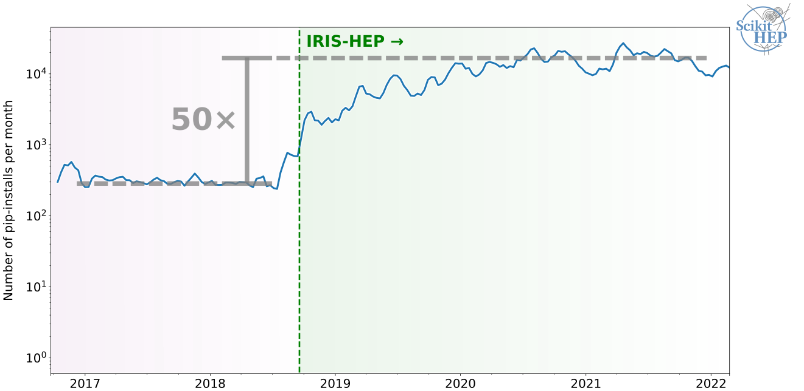
   </a>

.center.large["pip install XYZ" download rate for MacOS/Windows (no batch jobs) in aggregate]

.footnote[[Modern Python analysis ecosystem for High Energy Physics](https://matthewfeickert.github.io/talk-doepy-python-exchange-2022/2022-06-29.pdf), Jim Pivarski, Matthew Feickert, Gordon Watts]

---
# Community adoption with ecosystem growth

   <a href="https://github.com/matthewfeickert/talk-analysis-ecosystems-workshop-2022/issues/1">
      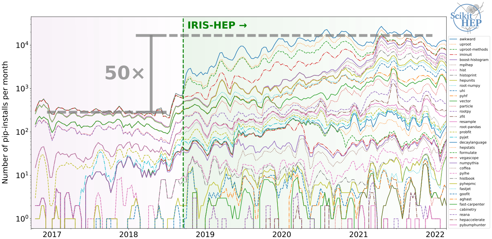
   </a>

.center.large["pip install XYZ" download rate for MacOS/Windows (no batch jobs) by package]
.caption[Aided by interoperable design]

.footnote[[Modern Python analysis ecosystem for High Energy Physics](https://matthewfeickert.github.io/talk-doepy-python-exchange-2022/2022-06-29.pdf), Jim Pivarski, Matthew Feickert, Gordon Watts]

---
# JSON spec fully describes the HistFactory model

.kol-1-4.width-100[
- Human & machine readable .bold[declarative] statistical models
- Industry standard
   - Will be with us forever
- Parsable by every language
   - Highly portable
   - Bidirectional translation  with `C++` ROOT
- Versionable and easily preserved
   - JSON Schema [describing  HistFactory specification](https://scikit-hep.org/pyhf/likelihood.html#bibliography)
   - Attractive for analysis preservation
   - Highly compressible
]
.kol-3-4[

   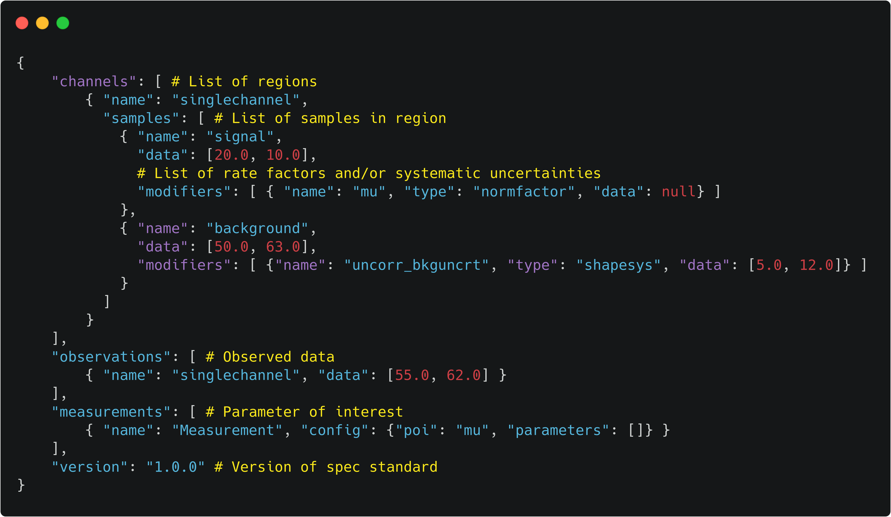

.center[[`JSON` defining a single channel, two bin counting experiment with systematics](https://scikit-hep.org/pyhf/likelihood.html#toy-example)]
]

---
# Extending model portability with HS3

.kol-3-5.large[
* [High Energy Physics Statistics Serialization Standard](https://github.com/hep-statistics-serialization-standard/hep-fit-serialization) (HS3)
   - Make statistical models: persistent, interchangeable, modifiable, readable
* Goal: Generalize the pyhf JSON model spec to a feature complete specification for particle physics
   - Ongoing work across the HS3 team and adopting tool teams
   - Tackle supporting more of the "open world" of statistical modeling
* HS3 spec will support statistical libraries RooFit (`C++`/`ROOT`), pyhf (Python), BAT (Julia), and others
   - Write once, run anywhere
   - Draft v0.2 currently in alpha (first deployment in `ROOTFit`)
]
.kol-2-5[
 
 

   <a href="https://github.com/hep-statistics-serialization-standard/hep-fit-serialization">
      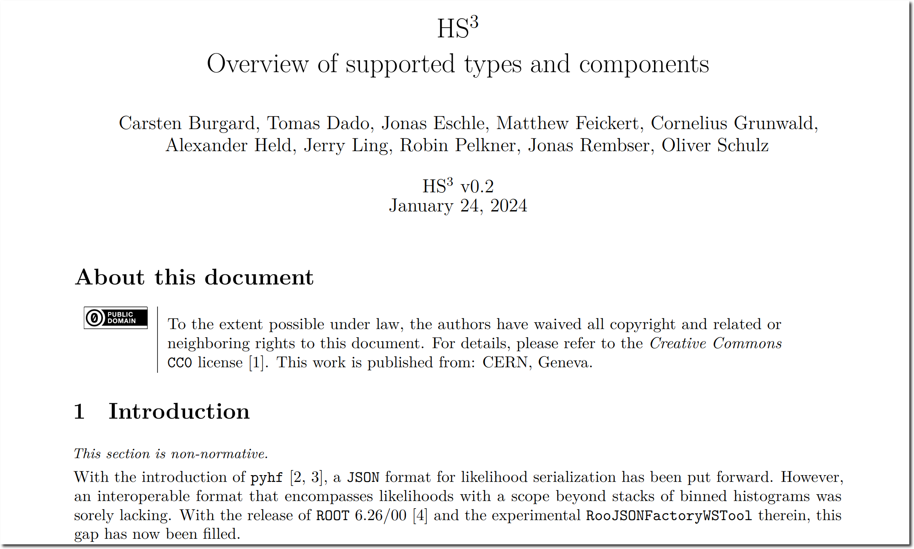
   </a>

]

---
# References

1. Lukas Heinrich, .italic[[Distributed Gradients for Differentiable Analysis](https://indico.cern.ch/event/960587/contributions/4070325/)], [Future Analysis Systems and Facilities Workshop](https://indico.cern.ch/event/960587/), 2020.
2. Jim Pivarski, .italic[[History and Adoption of Programming Languages in NHEP](https://github.com/jpivarski-talks/2022-02-08-jlab-roundtable-language-history)], [Software & Computing Round Table](https://indico.jlab.org/event/505/#day-2022-02-08), 2022.

---

class: end-slide, center
count: false

The end.
